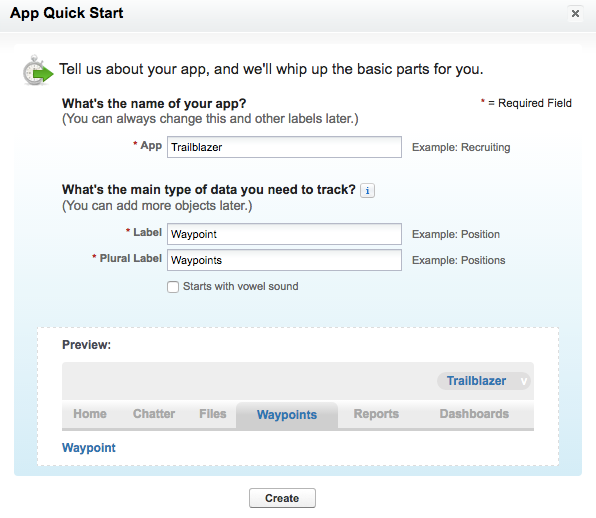

## Einführung
In diesem Schnelleinstieg wird gezeigt, wie Sie eine einfache Anwendung erstellen, ohne eine einzige Codezeile zu schreiben. Wenn Sie eine Anwendung auf der Salesforce-Plattform erstellen, sind viele Funktionen bereits automatisch integriert, z. B.:

* Datenbank für die Verwaltung von Informationen
* Sicherheitsfunktionen zum Schützen von Daten und zum Festlegen von Zugriffsrechten in Ihrer Organisation
* Geschäftslogik zum Ausführen bestimmter Aufgaben bei bestimmten Bedingungen
* Benutzeroberfläche zum Anzeigen von Daten und Funktionen
* Hochgradig anpassbare mobile Anwendung
* Natives soziales Umfeld, das eine Interaktion mit Personen oder Daten ermöglicht
* Analysefunktionen und Dashboards für eine übersichtliche und aussagekräftige Anzeige der Daten
* Mehrere APIs für die Integration mit externen Systemen
* Möglichkeit zum Installieren und Erstellen von Drittanbieteranwendungen

Die Anwendung, die Sie in diesem Schelleinstieg erstellen, hilft Ihnen, sich bei Ihrem Besuch im nahegelegenden Nationalpark zurechtzufinden. Dazu werden die Orte, die Sie besuchen und besichtigen möchten aufgezeichnet.

## Erstellen der Trailblazer-Anwendung
Wenn Sie eine Anwendung erstellen, wird automatisch ein Datenobjekt erstellt. In Salesforce wird das betreffende Datenobjekt *benutzerdefiniertes Objekt* genannt. Wenn Sie mit Tabellenkalkulationsprogrammen vertraut sind, können Sie sich ein benutzerdefiniertes Objekt als Arbeitsblatt vorstellen. Wenn Sie mehr mit Datenbanken zu tun haben, ist ein benutzerdefiniertes Objekt etwas Ähnliches wie eine Tabelle.

Ein benutzerdefiniertes Objekt umfasst Standardfelder und Anzeigen, mit denen Sie Informationen zum Objekt auflisten, anzeigen und bearbeiten können. Sie können aber auch eigene Felder hinzufügen, um nahezu alle erdenklichen Informationen zu verfolgen oder aufzulisten. Wenn Sie diesen Schnelleinstieg abgeschlossen haben, verfügen Sie über eine funktionierende Anwendung mit einem eigenen Menü, einer Registerkarte und einem benutzerdefinierten Objekt, das die Namen der Orte aufzeichnet, die Sie besuchen möchten.

Zuallererst erstellen Sie eine Anwendung namens Trailblazer. Darüber hinaus fügen Sie ein benutzerdefiniertes Objekt namens Waypoint (Wegpunkt) hinzu. Dabei handelt es sich um eine Zwischenstation auf Ihrem Weg durch den Nationalpark.

1. Klicken Sie auf der Force.com-Setup-Seite auf die grüne Schaltfläche **Anwendung hinzufügen**. Klicken Sie oben rechts im Bildschirm auf **Setup**, wenn die große grüne Schaltfläche nicht angezeigt wird. 

2. Füllen Sie das Formular folgendermaßen aus:
	* Geben Sie als Anwendungsname <code>Trailblazer</code> ein.
	* Geben Sie als Bezeichnung <code>Waypoint</code> ein.
	* Geben Sie als Plural-Bezeichnung <code>Waypoints</code> ein.

	

3. Klicken Sie auf **Erstellen**. Klicken Sie am Ende des Assistenten auf **Zu meiner Anwendung wechseln**. 

4. Klicken Sie auf **Tour starten**, um eine schnelle Übersicht über Ihre Anwendung zu erhalten. 
