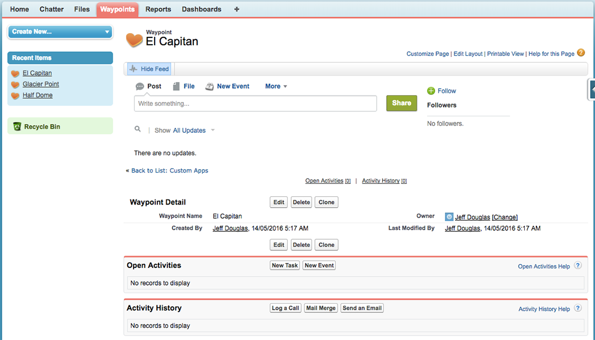

## Ausprobieren der Anwendung
Ihre Anwendung ist jetzt einsatzbereit! Sie können zunächst einige Wegpunkte im Nationalpark hinzufügen, die Sie besuchen möchten. Beginnen wir mit einigen Orten im Yosemite National Park.

1. Klicken Sie auf **Neu**, um einen neuen Wegpunkt hinzuzufügen. 
2. Weisen Sie den Namen <code>Half Dome</code> zu und klicken Sie auf **Speichern & Neu**.  
3. Erstellen Sie einen weiteren Wegpunkt namens <code>Glacier Point</code> und klicken Sie auf **Speichern & Neu**.  
4. Erstellen Sie einen weiteren Wegpunkt namens <code>El Capitan</code> und klicken Sie auf **Speichern**.  

Werfen Sie einen Blick auf den letzten erstellten Wegpunkt, <code>El Capitan</code>. In der Datensatzansicht werden Feed, Felder, Aktivitäten und alle anderen Daten angezeigt, die Sie für diesen Datensatz aufzeichnen möchten.

Beachten Sie außerdem das Herzsymbol, das für die Darstellung dieser Registerkarte verwendet wird. Diese Symbole werden zufällig ausgewählt, sodass für Ihre Anwendung u. U. ein anderes Symbol verwendet wird. Sie können dieses Symbol ggf. natürlich ändern. (Klicken Sie auf **Setup | Erstellen | Registerkarten** und dann auf den Link **Bearbeiten** neben Ihrer Waypoint-Registerkarte.)

* **Feed**: Im Chatter-Feed werden die Informationen angezeigt, an denen Sie interessiert sind, z. B. Personen, Datensätze und Gruppen. Sie können den Feed anpassen, um genau zu sehen, was Sie verfolgen möchten.
* **Details**: Das benutzerdefinierte Waypoint-Objekt umfasst vier Felder: Waypoint-Name (Half Dome, Glacier Point und El Capitan) und drei vom System erstellte Felder ("Erstellt von", "Inhaber", "Zuletzt geändert von"). Beim Erstellen Ihrer Anwendung können Sie weitere Felder hinzufügen, um die Informationen zu verfeinern, die Sie verfolgen möchten.
* **Aktivitäten**: Aktivitäten sind *Aufgaben* und *Ereignisse*, die dem jeweiligen Datensatz zugeordnet sind. Aufgaben sind Dinge, die erledigt werden müssen, und Ereignisse sind Besprechungen. Aktivitäten werden in diesem Schnelleinstieg nicht weiter behandelt. Dabei handelt es sich aber um eine praktische und leistungsfähige Funktion, die Sie schätzen werden.
