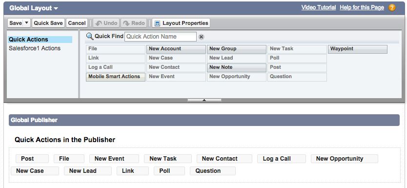
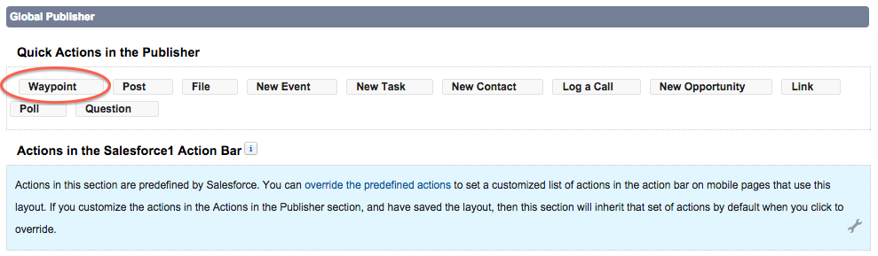

## Hinzufügen einer Schnellaktion
Wenn Sie eine Anwendung mit App Cloud erstellen, wird automatisch eine mobile Version der Anwendung erstellt. Wie Sie sich denken können, gibt es viele Möglichkeiten, um die mobile Anwendung anzupassen. In diesem Schritt erstellen Sie eine Schnellaktion.

Schnellaktionen sind Aktionen, die sofort auf dem mobilen Gerät durchgeführt werden sollen. Diese Aktionen werden in einem speziellen Bereich namens Publisher verwaltet. Sie können den Publisher anpassen, damit die jeweils wichtigsten Aktionen schnell zugänglich sind.  

Lassen Sie uns zunächst die Schnellaktion erstellen.

1. Klicken Sie auf **Setup** und dann im linken Bereich auf **Erstellen**.
2. Klicken Sie auf **Globale Aktionen** und dann auf **Globale Aktionen**.
3. Klicken Sie auf **Neue Aktion**.
2. Belassen Sie "Aktionstyp" auf **Datensatz erstellen**. Wählen Sie im Feld "Zielobjekt" die Option **Waypoint** aus.
3. Geben Sie <code>Waypoint</code> im Feld "Bezeichnung" ein.
4. Klicken Sie auf **Speichern**.
5. Behalten Sie im nächsten Aktionslayout-Bildschirm **Waypoint-Name** als einziges Feld im Layout. Klicken Sie auf **Speichern**.

Jetzt müssen Sie diese Schnellaktion zum Publisher hinzufügen. Das Publisher-Layout bestimmt die Schnellaktionen, die in der Aktionsleiste sichtbar sind.

1. Klicken Sie auf der linken Seite unter **Erstellen** | **Globale Aktionen** auf **Publisher-Layouts**.

2. Klicken Sie neben dem globalen Layout auf **Bearbeiten**.

2. Salesforce platziert einige Schnellaktionen standardmäßig im Publisher. Lassen Sie uns einige Aktionen entfernen, die Sie möglicherweise nicht benötigen. Entfernen Sie **Datei**, indem Sie im globalen Publisher auf diese Aktion klicken und sie in den globalen Layoutbereich ziehen.

  

3. Entfernen Sie genauso **Neuer Kundenvorgang** und **Neuer Lead** (sofern vorhanden).

4. Fügen Sie jetzt Ihre **Waypoint**-Aktion hinzu, indem Sie sie aus dem globalen Layout in den globalen Publisher darunter ziehen.

5. Sie können die Aktionen beliebig verschieben. Ziehen Sie **Waypoint** an die erste Stelle.

  

6. Klicken Sie im globalen Layout auf **Speichern**.

In nur wenigen Minuten haben Sie viel erreicht. Sie haben nicht nur eine Anwendung erstellt, sondern auch die mobile Salesforce1-Anwendung angepasst. Sehen wir uns an, wie die Anwendung auf dem mobilen Gerät arbeitet.
