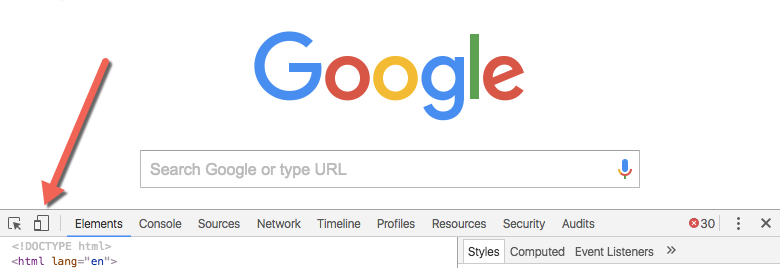
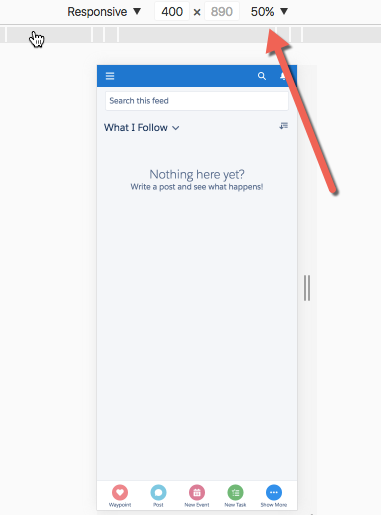
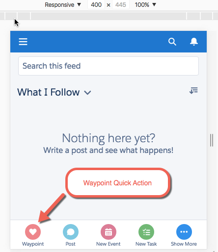

## Verwenden der mobilen Salesforce1-Anwendung
Auf die Salesforce1-Anwendung können Sie auf dreierlei Arten zugreifen:

* Als herunterladbare mobile Anwendung (Salesforce1), die Sie über Apple AppStore oder Google Play auf Ihrem Telefon installieren
* Durch Aufrufen von <code>login.salesforce.com</code> mit einem mobilen Browser
* Mithilfe der Entwicklertools von Chrome

In diesem Schritt wird die letzte Option verwendet. 

1. Öffnen Sie einen neuen Tab in Ihrem Chrome-Browser und rufen Sie die Entwicklertools auf, indem Sie auf **Menü** | **Weitere Tools** | **Entwicklertools** klicken.
2. Klicken Sie auf die Schaltfläche "Toggle Device Mode", um mit Ihrem Browser ein mobiles Gerät zu simulieren.

  

3. Um die Salesforce1-Anwendung in Ihrem Browser zu simulieren, kopieren Sie den URL aus dem vorherigen Tab und fügen ihn ein. Entfernen Sie den Teil des URLs, der direkt auf `salesforce.com/` folgt. Beispiel:

  
  

4. Fügen Sie `/one/one.app` am Ende des URLs hinter salesforce.com hinzu, um die Salesforce1-Simulationsanwendung zu starten. Beispiel:

  

5. Sollte die Anzeige zu klein sein, ändern Sie die Größe in 100%.

  

6. Nach der Änderung der Anzeigegröße werden am unteren Rand einige Symbole sichtbar. Das erste Symbol ist die Schnellaktion, die einen neuen Wegpunkt erstellt. Klicken Sie auf das Symbol. In Ihrer Organisation wird für diese Aktion u. U. ein anderes Symbol verwendet als das unten dargestellte Herzsymbol.

  

7. Rufen Sie den nächsten Wegpunkt <code>Tunnel View</code> auf und klicken Sie dann auf **Speichern**.

Werfen Sie jetzt einen Blick auf alle erstellten Wegpunkte.

1. Klicken Sie oben auf das Navigationssymbol , blättern Sie nach unten und klicken Sie auf den Menüpunkt **Mehr**.
2. Wenn Sie auf das **Waypoints**-Symbol klicken, werden alle Wegpunkte angezeigt, die Sie für Ihren Besuch des Yosemite National Park erstellt haben.

## Zusammenfassung
**Glückwunsch!** Sie haben mit wenigen Klicks eine eigene Webanwendung erstellt, mit der Sie die Orte nachverfolgen können, die Sie im nahegelegenen Nationalpark besuchen möchten. Darüber hinaus haben Sie die mobile Anwendung angepasst und eine Schnellaktion hinzugefügt, damit Sie mühelos weitere Wegpunkte hinzufügen können. Sie könnten diese Anwendung jetzt weiter ausgestalten. Entsprechende Ideen finden Sie in den anderen Schnelleinstiegen sowie Trails, Modulen und Projekten in Trailhead.
