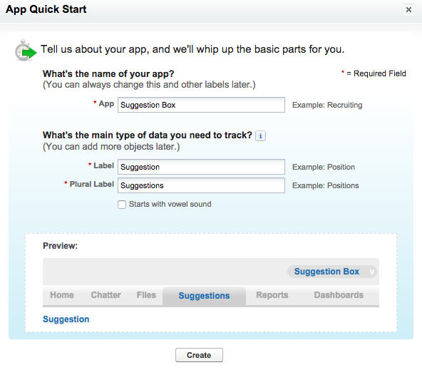
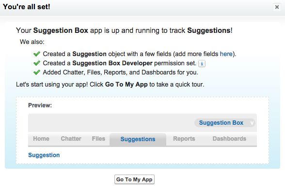
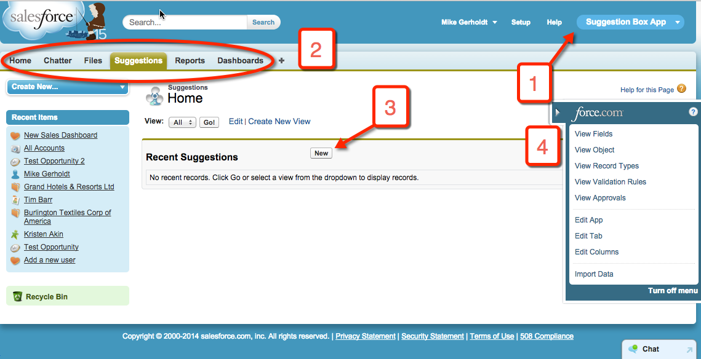
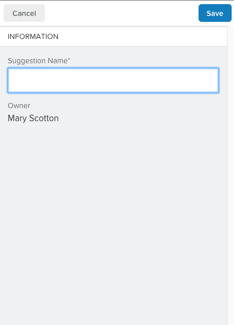

## [ש是Introduction是ש]

[Eöש是Eöש是Eöש是Eöש是Eöש是Eöש是Eöש是Eöש是Eöש是Eöש是Eöש是Eöש是Eöש是Eöש是Eöש是Eöש是Eöש是是In this project, you learn how to build an application on the Salesforce1 Platform from start to finish, without writing any code. If you're new to the Salesforce1 Platform, the goal is to introduce you to the basics of app building. These point-and-click skills apply whether or not you plan to write code on the platform. If you're familiar with the Salesforce1 Platform Admin features—managing users and security, customizing standard objects, and so on—the goal is to apply those skills to developing new applications. You need a Developer Edition org to complete this project. If you don't have one, you can sign up <a target="_blank" href="https://developer.salesforce.com/signup">here</a>.是שöE是שöE是שöE是שöE是שöE是שöE是שöE是שöE是שöE是שöE是שöE是שöE是שöE是שöE是שöE是שöE是שöE是ש]

[Eöש是Eöש是Eöש是是You will build a suggestion management app that allows employees to submit suggestions and track their status using these steps.是שöE是שöE是שöE是]

1. [Eöש是Eöש是Eöש是 Create the app definition and a data model for the application. This simple application requires only one custom object.是שöE是שöE是שöE]

2. [Eöש是Eöש是Eöש是 Modify the user interface on the browser and on Salesforce1 Mobile using page layouts, compact layouts, and global actions.是שöE是שöE是שöE是]

3. [Eöש是Eöש是Eöש是ש是 Automate calculations, data quality, and database updates to improve the user experience using formulas, validation rules, and a process builder.是שöE是שöE是שöE是שö]

4. [Eöש是Eöש是Eöש是是 Define reports, charts, and dashboards to track the status of suggestions and analyze how well the company manages suggestions.是שöE是שöE是שöE是]

[Eöש是Eöש是Eöש是Eöש是Eöש是是Note: Instead of creating a Suggestions custom object, you could use Cases, a Salesforce Service Cloud standard object. But in this example, we want to explore building a custom app without using Service Cloud.是שöE是שöE是שöE是שöE是שöE是]

## [Eöש是Creating a Suggestion Box App是שöE是]

#### [ש是What You’ll Do是ש]

* [Eöש是Eöש是Eöש是Create a Force.com app that includes standard collaboration and analytics features.是שöE是שöE是שöE是]

* [Eöש是Eöש是ש是Familiarize yourself with the app’s user interface in the browser and in the Salesforce1 Mobile app. 是שöE是שöE是ש]

#### [Eöש是ש是Step 1: Create an App and a Custom Object是שöE是ש]

1. [Eöש是Eöש是öש是 Log in to your Developer Edition (DE) org using your username (in the form of an email address) and password.是שöE是שöE是שö]

3. [Eöש是Eöש是Eöש是Eöש是Eöש是是 From the Force.com Home page, click the green **Add App** button in the Getting Started section. If you’re starting from somewhere else, click **Setup** in the upper right corner to get to the Force.com Home page.是שöE是שöE是שöE是שöE是שöE是ש]

4. [Eöש是 Fill in the form as follows:是שöE是]
   * [öש是App: **Suggestion Box**是שöE]
   * [öש是Label: **Suggestion**是שö]
   * [Eöש是是Plural Label:  **Suggestions** 是שöE是]
  
5. [Eöש是Eöש是Eöש是是 Click **Create**. Right away you see some of the functionality that’s automatically added.是שöE是שöE是שöE是ש]
   
6. [öש是 Click **Go To My App**.是שöE]
7. [Eöש是Eöש是Eöש是ש是 Click **Start Tour** and follow along for a quick overview of your app’s built-in user interface.是שöE是שöE是שöE是שö]

#### [öש是Step 2: Tour the App是שö]

  

1. [Eöש是Eöש是ש是 **Force.com app menu** — Shows the apps that are available to you. The app you just created is selected.是שöE是שöE是שö]

2. [Eöש是Eöש是Eöש是Eöש是Eöש是ש是 **Tabs** — Provides an easy way to find and organize data within an app. In the Suggestions tab, you can create, view, and edit Suggestion records. The other tabs are standard feature tabs that are included with every app.是שöE是שöE是שöE是שöE是שöE是שö]

3. [Eöש是Eöש是Eöש是Eöש是Eöש是 **Create records** — Click **New** to add records to your custom object. If you click this button now, you see only one data entry field in the object, but you’ll create more in the following steps.是שöE是שöE是שöE是שöE是שöE]

4. [Eöש是Eöש是Eöש是Eöש是Eöש是öש是 **Force.com Quick Access menu** — Quickly jump to relevant app customization features. The menu is available from any object list view page and record detail page, but only for users with the "Customize Application" permission.是שöE是שöE是שöE是שöE是שöE是שö]

#### [Eöש是Step 3: Try Out the Mobile App是שöE是]

[Eöש是Eöש是Eöש是Eöש是When you create an app in the Salesforce1 Platform, you automatically create a mobile version of the app. You can access the Salesforce1 mobile app in two ways:是שöE是שöE是שöE是שöE]

* [Eöש是Eöש是öש是As a downloadable mobile app (Salesforce1) that you install on your phone是שöE是שöE是שö]

* [Eöש是Eöש是是By navigating to login.salesforce.com using a mobile browser是שöE是שöE是]

[Eöש是ש是For this step, we'll use the last option.是שöE是ש]

1. [Eöש是Eöש是Eöש是ש是 Open a browser on your phone or tablet and navigate to http://login.salesforce.com. The mobile browser version of Salesforce1 is displayed. 是שöE是שöE是שöE是ש]

[öש是To see your Suggestions:是שöE]

1. [Eöש是Eöש是Eöש是Click the  icon to open the left navigation bar.是שöE是שöE是שöE]

2. [Eöש是Eöש是Eöש是Eöש是是 Find the Suggestions object under Recent (you need to click **Show More** to see it). Click **Suggestions** to display your recently viewed suggestions, if you have any.是שöE是שöE是שöE是שöE是]

3. [Eöש是ש是 Click **New** to create a suggestion. 是שöE是שö]
    
4. [Eöש是Eöש是Eöש是 Enter a sample suggestion (maybe something like "classic Galaga arcade game in every conference room!"), and click **Save**.是שöE是שöE是שöE是]

[Eöש是Eöש是öש是With just one button click, you're on your way to building a mobile app!是שöE是שöE是שö]

## [ש是Resources是ש]

* [Eöש是Eöש是Eöש是Eöש是是<a target="_blank" href="https://developer.salesforce.com/trailhead/starting_force_com/starting_intro">Salesforce Platform Basics > Getting Started with the Platform</a>是שöE是שöE是שöE是שöE是]

* [Eöש是Eöש是Eöש是Eöש是Eöש是<a target="_blank" href="https://developer.salesforce.com/trailhead/salesforce1_mobile_app/salesforce1_mobile_app_intro">Salesforce1 Mobile Basics > Getting Started with the Salesforce1 Mobile App</a>是שöE是שöE是שöE是שöE是שöE]
