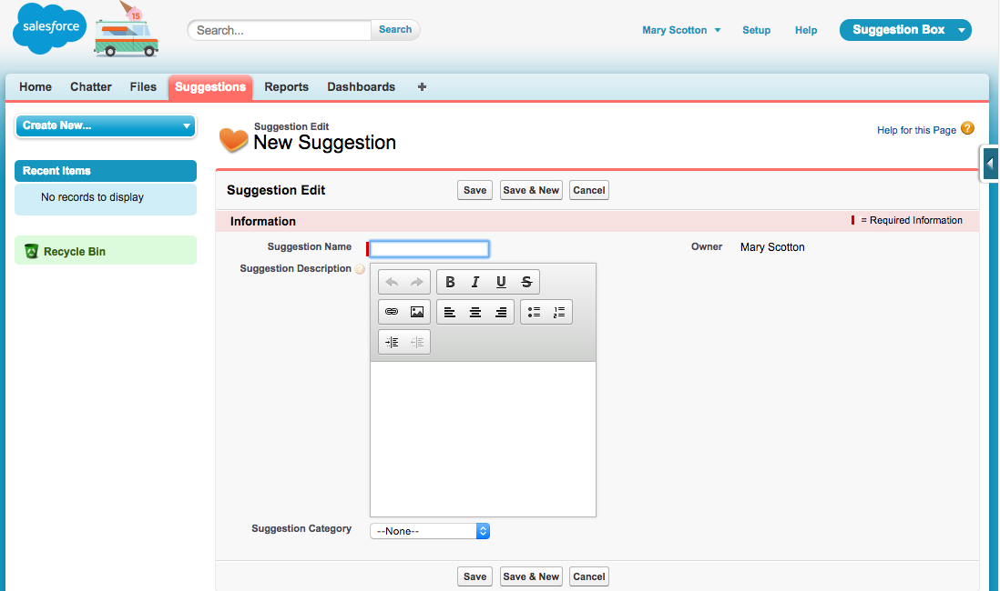
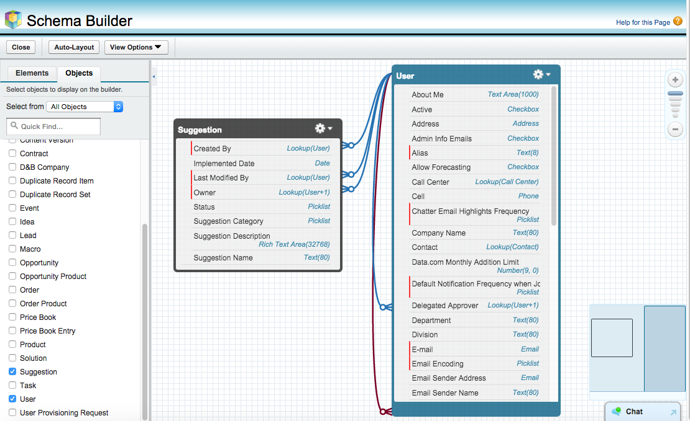
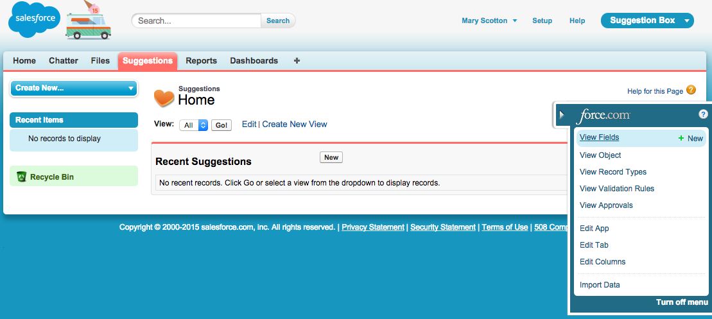
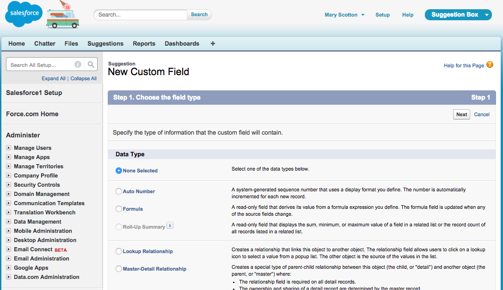

## [öש是Adding Custom Fields是שö]

#### [ש是What You’ll Do是ש]

* [Eöש是Eöש是öש是Create custom fields with the Custom Field Wizard and the Schema Builder.是שöE是שöE是שö]

* [Eöש是Eöש是是Try the app in the browser and in the Salesforce1 Mobile app.是שöE是שöE是]

[Eöש是Eöש是Eöש是Eöש是Eöש是Eöש是Eöש是By default, your custom object has some standard fields on it. You need to add more fields to store relevant information about each suggestion. Fields can store many types of data. Feel free to explore these later as you extend your app. For now, let’s add a few that we know we need.是שöE是שöE是שöE是שöE是שöE是שöE是שöE是]

[Eöש是Eöש是öש是You can add a new field from the Force.com Quick Access menu by hovering on **View Fields** and clicking **New**. 是שöE是שöE是שöE]

[Eöש是是You can also add a new field this way:是שöE是ש]

1. [Eöש是Eöש是 Click **Setup** | **Build** | **Create** | **Objects.**是שöE是שöE是]

2. [Eöש是Eöש是ש是 Click the name of your object (in this example, click **Suggestion**).是שöE是שöE是שö]

3. [Eöש是Eöש是是 Scroll down to the **Custom Fields & Relationships** section.是שöE是שöE是ש]

4. [ש是 Click **New.**是ש]

[Eöש是öש是Both ways get you to the New Custom Field wizard.是שöE是שöE]

#### [Eöש是Step 1: Add a Description field是שöE是]

[Eöש是Eöש是Eöש是Eöש是是This field will be used by employees when they explain their suggestion. You’ll create the field as a rich text area so that they can change font styles, add pictures, etc.是שöE是שöE是שöE是שöE是]

[Eöש是Eöש是Create the **Suggestion Description** field as follows:是שöE是שöE]

1. [Eöש是Eöש是是 For Data Type, select **Text Area (Rich)**, and click **Next**.是שöE是שöE是ש]
    
2. [Eöש是是 Fill in the custom field details:是שöE是]
  * [Eöש是ש是Field Label: **Suggestion Description**是שöE是ש]
  * [ש是Length: **32,768**是שö]
  * [öש是Visible Lines: **10**是שö]
  * [Eöש是是Field Name: **Suggestion_Description**是שöE是ש]
  * [Eöש是Eöש是Eöש是是Help Text: **Please enter as much detail - including pictures - around this suggestion so we clearly understand your idea.**是שöE是שöE是שöE是]
3. [ש是 Click **Next**.是שö]

4. [Eöש是Eöש是Eöש是 Click **Next** again to accept the default field visibility and security settings.是שöE是שöE是שöE是]

5. [Eöש是Eöש是Eöש是Eöש是 Click **Save & New** to add the Suggestion Description to the page layout, save the Suggestion Description field, and return to the first step of the wizard.是שöE是שöE是שöE是שöE]

#### [Eöש是Step 2: Add a Category Field是שöE]

[Eöש是Eöש是Eöש是ש是This field will help us categorize each suggestion. It will also make it easier for us to report on what types of suggestions we get the most.是שöE是שöE是שöE是ש]

[Eöש是Eöש是Create the **Suggestion Category** field as follows:是שöE是שöE]

1. [Eöש是Eöש是 For Data Type, select **Picklist**, and click **Next**.是שöE是שöE是]

2. [Eöש是是 Fill in the custom field details:是שöE是]
  * [Eöש是是Field Label: **Suggestion Category**是שöE是ש]
  * [Eöש是Eöש是Enter the following values for the picklist (one per line)是שöE是שöE是]
    - [öש是**Customer Service**是שö]
    - [öש是**Employee Services**是שö]
    - [ש是**Facilities/ IT**是שö]
    - [ש是**Kitchen Snacks**是שö]
    - [ש是**Other**是ש]
  * [Eöש是Eöש是Leave the Sort Values Alphabetically - **Unchecked**.是שöE是שöE是]
  * [Eöש是Eöש是是Leave the Use first value as default value - **Unchecked**.是שöE是שöE是ש]
3. [Eöש是Eöש是ש是 Leave the defaults for the remaining fields, and click **Next**.是שöE是שöE是ש]

4. [Eöש是Eöש是Eöש是 Click **Next** again to accept the default field visibility and security settings.是שöE是שöE是שöE是]

5. [Eöש是Eöש是ש是 Click **Save** to add the Suggestion Category to the page layout and save the Suggestion Category field.是שöE是שöE是שö]

#### [öש是Step 3: Try Out the App是שöE]

[Eöש是Eöש是Eöש是Eöש是Eöש是是Check your work by returning to the Suggestions tab and clicking the **New** button. You should see that your two custom fields were added to the Suggestion page. Fill in a sample suggestion and click **Save**. 是שöE是שöE是שöE是שöE是שöE是]

[Eöש是Eöש是Eöש是Eöש是Eöש是Try adding a record in the Salesforce1 Mobile App, too. Note that the Suggestion page layout is the same on the browser as it is in the mobile app. That's the power of "build once, deploy anywhere" metadata.是שöE是שöE是שöE是שöE是שöE是]

#### [Eöש是ש是Step 4: Viewing Objects in Schema Builder是שöE是ש]

[Eöש是Eöש是Eöש是Eöש是Eöש是Eöש是öש是Schema Builder provides a dynamic environment to add new custom objects, custom fields, and relationships to your Salesforce database. It also eliminates the need to click from page to page to add a new custom field to an object or to find the details of a relationship. 是שöE是שöE是שöE是שöE是שöE是שöE是שö]

[Eöש是Eöש是öש是Let’s take a look at the Suggestion custom object in the Schema Builder.是שöE是שöE是שö]

1. [Eöש是öש是 Click **Setup** | **Build** | **Schema Builder**.是שöE是שöE]

2. [Eöש是Eöש是Eöש是öש是 From the Objects Palette (left-hand side) select the **Suggestion** object and the **User** object.是שöE是שöE是שöE是שö]

3. [Eöש是Eöש是Eöש是是 If you don’t see your objects in the Canvas area, click **Auto-Layout** and drag them around until you like how they are arranged. 是שöE是שöE是שöE是]

[Eöש是Eöש是öש是Let’s add more fields so that you can track the progress of a Suggestion.是שöE是שöE是שö]

#### [Eöש是Step 5: Add a Status field是שöE]

[Eöש是Eöש是Eöש是ש是This field will help us track the status of the suggestion. It is also a way for the suggestor to know what is going on with their suggestion.是שöE是שöE是שöE是ש]

[Eöש是Eöש是Eöש是是This field will have unique security around it in that only Admins can change the status.是שöE是שöE是שöE是ש]

1. [Eöש是Eöש是Eöש是öש是 Click the **Elements** tab in the left-hand side Palette. This displays all of the new things you can add to your database schema: objects and fields.是שöE是שöE是שöE是שö]

2. [Eöש是Eöש是öש是 Drag the **Picklist** field type and drop it on the Suggestions object.是שöE是שöE是שö]

3. [Eöש是是 Fill in the custom field details:是שöE是]
  * [öש是Field Label: **Status**是שöE]
  * [öש是Field Name: **Status**是שöE]
  * [Eöש是Eöש是Enter the following Values for the picklist (one per line)是שöE是שöE是]
    - [ש是**New**是]
    - [öש是**Under Consideration**是שöE]
    - [ש是**In Progress**是ש]
    - [ש是**Implemented**是ש]
4. [Eöש是Eöש是 Leave the Sort Values Alphabetically - **Unchecked**.是שöE是שöE]

5. [Eöש是öש是 **Check** the Use first value as default value.是שöE是שö]

6. [Eöש是Eöש是Eöש是Eöש是 Click **Save** to save the Status field. You should see the Status field at the top of the list of fields in the Suggestion object’s box in the schema diagram.是שöE是שöE是שöE是שöE]

7. [Eöש是Eöש是Eöש是Eöש是öש是 Now, we'll update the Status field's security. While still in the Schema Builder, right-click on the Status field that you just added to the Suggestion object. Click **Manage Field Permissions**. 是שöE是שöE是שöE是שöE是שöE]

8. [Eöש是Eöש是ש是 Click the **Read-Only** checkbox at the top of the column to make this field read only for all users.是שöE是שöE是ש]

9. [Eöש是Eöש是Eöש是ש是 **Uncheck** the box in the Read-Only column next to System Administrator, then click **Save**.是שöE是שöE是שöE是ש]

#### [öש是Step 6: Add a Date field是שöE]

[Eöש是Eöש是Eöש是Eöש是是This field will help us track when the Suggestion was Implemented. It’s also important for us because we reference this field in the formula field created in a later exercise.是שöE是שöE是שöE是שöE是ש]

[Eöש是Eöש是Eöש是是This field will have unique security around it in that only Admins can change the date.是שöE是שöE是שöE是]

1. [Eöש是Eöש是ש是 Drag the **Date** field type and drop it on the Suggestions object.是שöE是שöE是ש]

2. [Eöש是是 Fill in the custom field details:是שöE是]
  * [Eöש是是Field Label: **Implemented Date**是שöE是]
  * [Eöש是是Field Name: **Implemented_Date**是שöE是]
  * [Eöש是ש是Leave the defaults for the remaining fields是שöE是שö]
  * [Eöש是Eöש是Eöש是Eöש是ש是Click **Save** to save the Implemented Date field. You should see the Implemented Date field at the top of the list of fields in the Suggestion object’s box in the schema diagram.是שöE是שöE是שöE是שöE是ש]
3. [Eöש是Eöש是Eöש是Eöש是Eöש是ש是 Now, we'll update the Implemented Date field's security. While still in the Schema Builder, right-click on the **Implemented Date** field that you just added to the Suggestion object. Click **Manage Field Permissions**. 是שöE是שöE是שöE是שöE是שöE是ש]

4. [Eöש是Eöש是ש是 Click the **Read-Only** checkbox at the top of the column to make this field read only for all users.是שöE是שöE是ש]

5. [Eöש是Eöש是Eöש是ש是 **Uncheck** the box in the Read-Only column next to System Administrator, then click **Save**.是שöE是שöE是שöE是ש]

#### [öש是Step 7: Try Out the App是שöE]

[Eöש是Eöש是Eöש是ש是Go back to the Suggestions tab in the browser, or to the Suggestions object in the Salesforce1 Mobile app, and create a new Suggestion record.是שöE是שöE是שöE是ש]

[Eöש是Eöש是Eöש是是Notice anything? Where are our two new fields we just created, Status and Implemented Date?是שöE是שöE是שöE是ש]

[Eöש是Eöש是Eöש是Eöש是Eöש是Eöש是Eöש是Eöש是Eöש是是Don’t worry, they are there, just not on the page layout. When you use the Field Wizard, you have the option to add the field to the page layout automatically. When you use the Schema Builder, you need to add the field using the Page Layout Editor. In the next exercise, we’ll do that, and make some other modifications to the user experience, to make the app easier to use.是שöE是שöE是שöE是שöE是שöE是שöE是שöE是שöE是שöE是ש]

## [ש是Resources是ש]

* [Eöש是Eöש是Eöש是Eöש是öש是<a target="_blank" href="https://developer.salesforce.com/trailhead/force_com_admin_beginner/data_modeling/creating_custom_objects_fields">Data Modeling > Creating Custom Objects and Fields</a>是שöE是שöE是שöE是שöE是שöE]

* [Eöש是Eöש是Eöש是Eöש是是<a target="_blank" href="https://developer.salesforce.com/trailhead/force_com_admin_beginner/data_modeling/schema_builder">Data Modeling > Working with Schema Builder</a>是שöE是שöE是שöE是שöE是]
