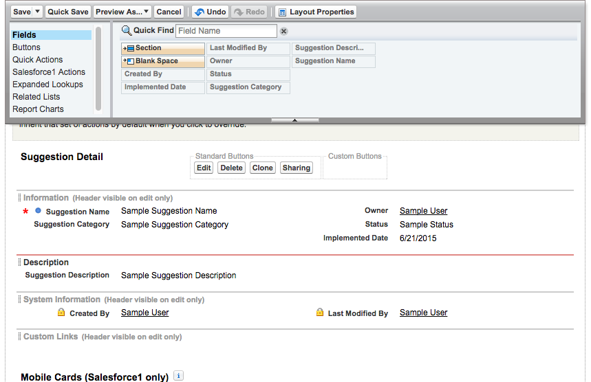

## [Eöש是Modifying the User Experience是שöE是]

#### [ש是What You’ll Do是ש]

* [öש是Modify the page layout.是שöE]

* [Eöש是Eöש是Modify the mobile user interface with a compact layout.是שöE是שöE]

* [Eöש是Eöש是是Add a global action to add suggestions directly from the Feed.是שöE是שöE是ש]

* [Eöש是Eöש是是Try the app in the browser or in the Salesforce1 Mobile app.是שöE是שöE是]

[Eöש是Eöש是Eöש是Eöש是Eöש是Eöש是Eöש是In the previous exercise you created fields to manage the data. Now, let’s make sure that employees have a great experience logging their Suggestions by arranging the fields in a usable manner, bringing the most important fields to their attention and making common tasks easy to do.是שöE是שöE是שöE是שöE是שöE是שöE是שöE是]

[Eöש是Eöש是Eöש是Eöש是Eöש是Eöש是Eöש是Eöש是Eöש是Changing the UI for the browser and mobile pages involves modifying the Suggestion object's page layout. You’ll also modify the Suggestion object's compact layout, which changes only the mobile app UI. Finally, you’ll add a Global Action to make it easy for employees to add suggestions wherever they are in the Salesforce app in both the browser and the mobile app.是שöE是שöE是שöE是שöE是שöE是שöE是שöE是שöE是שöE是]

#### [Eöש是Step 1: Modify the Page Layout是שöE是]

1. [Eöש是Eöש是 Click **Setup | Build | Create | Objects | Suggestion**.是שöE是שöE是]

2. [Eöש是Eöש是Eöש是是 Scroll down to the Page Layouts section, and click **Edit** next to the Suggestion Layout page layout. The Page Layout Editor opens.是שöE是שöE是שöE是ש]

3. [Eöש是öש是 Scroll down to the Suggestion Detail section.是שöE是שö]

    

4. [Eöש是Eöש是Eöש是是 In the Page Layout Editor, you have can have one or two columns in each section. Let’s add the missing fields and group fields together.是שöE是שöE是שöE是ש]
  * [Eöש是Eöש是Eöש是öש是Click the **Status** field and drag it to the right column in the Information section, under Owner.是שöE是שöE是שöE是שö]
  * [Eöש是Eöש是öש是Click the **Implemented Date** field and drag it to the right column in the Information section, under Status.是שöE是שöE是שö]
  * [öש是Click **Quick Save**.是שö]

[Eöש是Eöש是Now add a new section and rearrange the remaining fields.是שöE是שöE是]

1. [Eöש是Eöש是Eöש是Eöש是ש是 Add a section for Description. In the palette, click **Section** and drag it down until a green bar appears above the System Information section. Drop it there to create the section.是שöE是שöE是שöE是שöE是שö]

2. [Eöש是Eöש是öש是 In the Section Properties box, enter **Description** for the section name.是שöE是שöE是שö]

3. [Eöש是是 Choose **1-column** for the layout.是שöE是ש]

4. [ש是 Click **OK**.是ש]

5. [Eöש是Eöש是öש是 Drag the **Suggestion Description** field into your new section. Your page should look like this when finished.是שöE是שöE是שö]

    

7. [ש是 Click **Save**.是שö]

#### [Eöש是Step 2: Add a Compact Layout是שöE]

[Eöש是Eöש是Eöש是Eöש是Eöש是Eöש是Eöש是Mobile app users can now see the Status and Implemented Date fields, but with a small screen size, it’s useful to display important fields at the top of the screen. For custom objects, the Name field displays at the top by default. To add the other fields, you modify the compact layout.是שöE是שöE是שöE是שöE是שöE是שöE是שöE是]

1. [Eöש是Eöש是 Click **Setup | Build | Create | Objects | Suggestion**.是שöE是שöE是]

2. [Eöש是Eöש是是 Scroll down to the Compact Layouts section and click **New**.是שöE是שöE是ש]

3. [Eöש是 Enter the layout details.是שöE]
  * [öש是Label: **Suggestion**是שö]
  * [öש是Name: **Suggestion**是שö]
  * [Eöש是Eöש是ש是Selected Fields: **Suggestion Name, Suggestion Category, Status** 是שöE是שöE是שö]
    
4. [ש是 Click **Save**.是שö]

5. [Eöש是是 Click **Compact Layout Assignment**.是שöE是ש]

6. [Eöש是 Click **Edit Assignment**.是שöE]

7. [Eöש是Eöש是 Select **Suggestion** as the primary compact layout.是שöE是שöE]

8. [ש是 Click **Save**.是שö]

#### [Eöש是Step 3: Add a Global Action是שöE]

[Eöש是Eöש是Eöש是Eöש是Eöש是Eöש是Eöש是Eöש是Eöש是öש是Things are looking pretty good, but from talking to employees about how they work, we’ve found that they think of suggestions while they’re doing other tasks and don’t want to leave what they are doing to submit a suggestion. For example, if an employee is entering a contact name and thought of a customer service suggestion, the employee would have to do the following to enter a suggestion:是שöE是שöE是שöE是שöE是שöE是שöE是שöE是שöE是שöE是שöE]

* [Eöש是是Navigate to the Suggestion object是שöE是]
* [ש是Click New是ש]
* [Eöש是是Fill in the Suggestion information是שöE是]
* [ש是Save是ש]
* [Eöש是是Navigate back to the Contact record是שöE是]
* [Eöש是是Try to remember what they were doing!是שöE是ש]

[Eöש是Eöש是Eöש是ש是You want to make it easier for employees by reducing the number of clicks and keeping them in context. You can do this with a Global Action.是שöE是שöE是שöE是ש]

1. [Eöש是Eöש是ש是 Click **Setup | Build | Create | Global Actions | Global Actions**.是שöE是שöE是ש]

2. [öש是 Click **New Action**.是שöE]

3. [Eöש是 Enter the action details.是שöE]
  * [Eöש是是Action Type: **Create a Record**是שöE是]
  * [Eöש是Target Object: **Suggestion**是שöE是]
  * [Eöש是是Standard Label Type: **New [Record]**是שöE是ש]
  * [Eöש是Name: **New_Suggestion** 是שöE]
    

3. [Eöש是Eöש是Eöש是是 Click **Save**. This takes you to the Global Action layout so that you can select the fields to display when the action is selected.是שöE是שöE是שöE是ש]

4. [Eöש是Eöש是Eöש是Eöש是 Drag **Suggestion Category** and **Suggestion Description** onto the New Suggestion layout so that employees can enter those values when creating a suggestion.是שöE是שöE是שöE是שöE]

5. [ש是 Click **Save**.是שö]

    
6. [Eöש是Eöש是 In the Predefined Field Values section, click **New**.是שöE是שöE]

7. [Eöש是ש是 Enter the predefined field value details.是שöE是שö]
  * [öש是Field Name: **Status**是שöE]
  * [Eöש是A specific value: **New**是שöE]
8. [Eöש是Eöש是Eöש是ש是 Click **Save**. You have created a new action, but users cannot see it yet! Let's fix that next.是שöE是שöE是שöE是שö]

9. [Eöש是Eöש是ש是 Click **Setup | Build | Create | Global Actions | Publisher Layouts**.是שöE是שöE是שö]

10. [Eöש是ש是 Next to Global Layout, click **Edit**.是שöE是ש]

11. [Eöש是Eöש是Eöש是是 Drag the **New Suggestion** action into the Quick Actions in the Publisher section and drop it in the second position, after Post.是שöE是שöE是שöE是]

    
12. [ש是 Click **Save**.是שö]

#### [öש是Step 4: Try Out the App是שöE]

[Eöש是Eöש是Eöש是Eöש是Eöש是Eöש是Eöש是Eöש是Eöש是Eöש是Eöש是Eöש是Eöש是Eöש是öש是In the Suggestions tab, click **New** and fill out a suggestion. Notice how the experience has changed in the page layout. Switch to the mobile experience and add a suggestion from the mobile navigation menu. You should see the page layout changes and the new fields at the top of the screen from the compact layout change. Finally, add a suggestion from the Feed in the mobile app. Does the global action make it easier? If so, consider updating the page layouts for specific objects (like Contact) to add the New Suggestion action to the action bars that display when viewing those records.是שöE是שöE是שöE是שöE是שöE是שöE是שöE是שöE是שöE是שöE是שöE是שöE是שöE是שöE是שö]

## [ש是Resources是ש]

* [Eöש是Eöש是Eöש是öש是<a target="_blank" href="https://developer.salesforce.com/trailhead/customizing_user_interface/ui_page_layouts">UI Customization > Modifying Page Layouts</a>是שöE是שöE是שöE是שöE]

* [Eöש是Eöש是Eöש是Eöש是öש是<a target="_blank" href="https://developer.salesforce.com/trailhead/salesforce1_mobile_app/salesforce1_mobile_app_compact_layouts">Salesforce1 Mobile Basics > Customizing Compact Layouts</a>是שöE是שöE是שöE是שöE是שö]

* [Eöש是Eöש是Eöש是Eöש是öש是<a target="_blank" href="https://developer.salesforce.com/trailhead/salesforce1_mobile_app/salesforce1_mobile_app_actions_global">Salesforce1 Mobile Basics > Creating Global Quick Actions</a>是שöE是שöE是שöE是שöE是שö]

* [Eöש是Eöש是Eöש是Eöש是Eöש是是<a target="_blank" href="https://developer.salesforce.com/trailhead/salesforce1_mobile_app/salesforce1_mobile_app_actions_objectspecific">Salesforce1 Mobile Basics > Creating Object-Specific Quick Actions</a>是שöE是שöE是שöE是שöE是שöE是]
