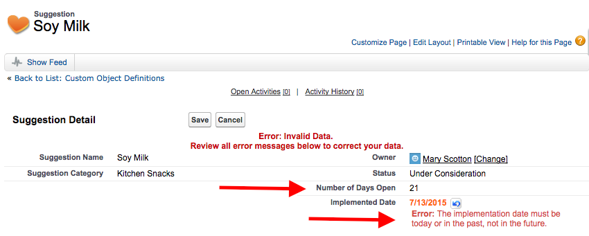
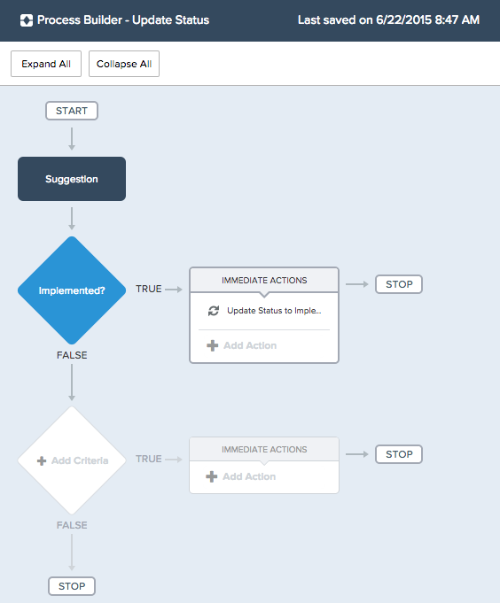
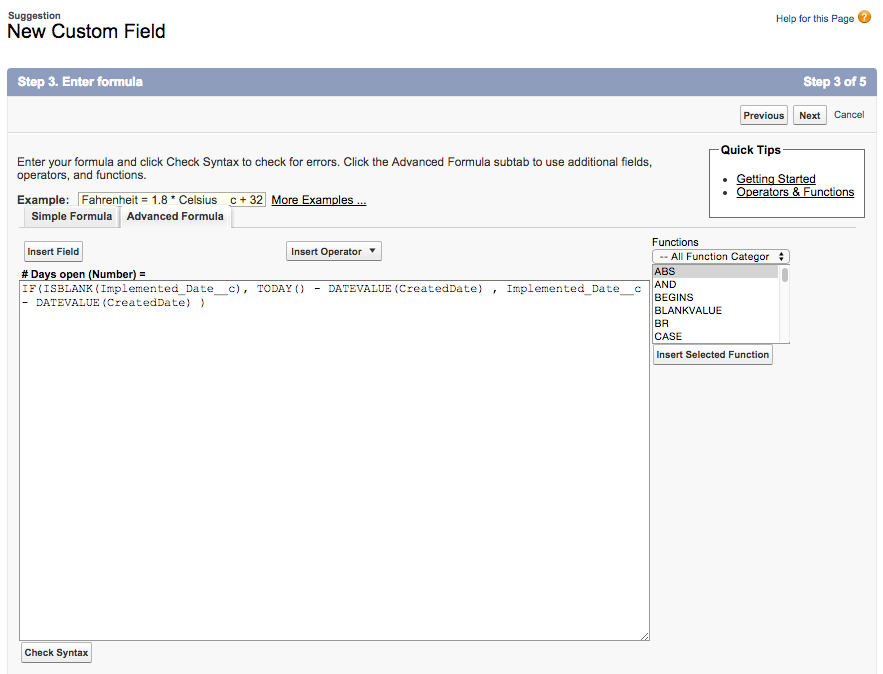
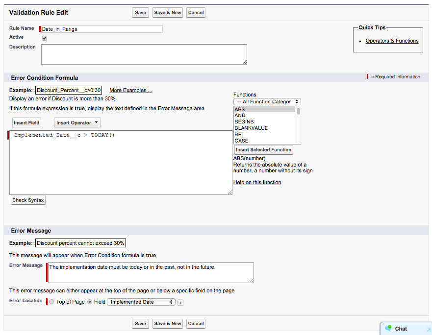
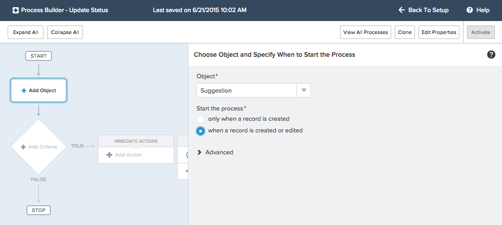
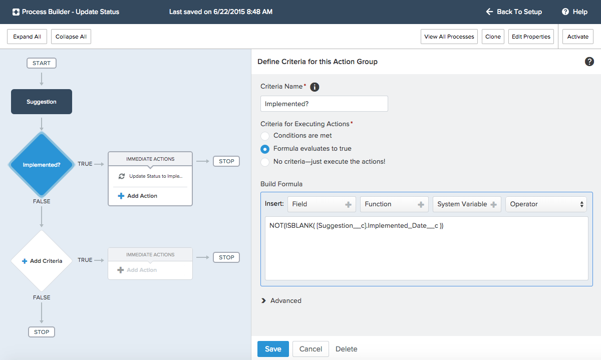
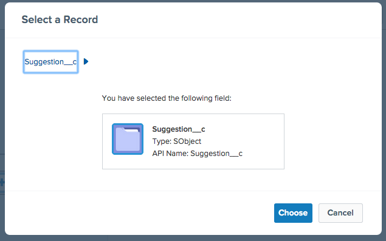
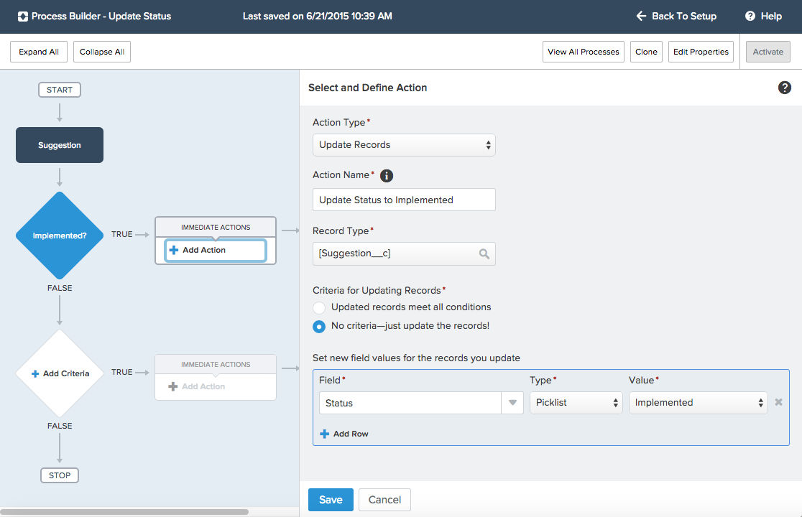

## [öש是Adding Business Logic 是שöE]

#### [ש是What You’ll Do是ש]

* [Eöש是Eöש是Eöש是Create a custom formula field to calculate the length of time between two dates.是שöE是שöE是שöE]

* [Eöש是Eöש是Eöש是Add a validation rule to enforce that the implemented date is not in the future.是שöE是שöE是שöE]

* [Eöש是Eöש是öש是Create a process to update a field when the value of another field changes.是שöE是שöE是שö]

* [Eöש是Eöש是Try the app in the browser or Salesforce1 Mobile app.是שöE是שöE]

[Eöש是Eöש是Eöש是Eöש是Eöש是ש是So far, your app lets employees securely enter and view data about suggestions on a browser or a mobile device. That’s pretty cool, but let’s make the platform work a little harder for us so that our users don’t have to.是שöE是שöE是שöE是שöE是שöE是ש]

#### [Eöש是Step 1: Add a Formula Field 是שöE]

[Eöש是Eöש是Eöש是Eöש是Eöש是是A formula field derives its value from other fields, expressions, or values, saving your users a lot of time. Let’s add a formula field to calculate the number of days from suggestion creation to implementation. 是שöE是שöE是שöE是שöE是שöE是]

1. [Eöש是Eöש是 Click **Setup | Build | Create | Objects | Suggestion**. 是שöE是שöE是]

2. [Eöש是Eöש是是 In the Custom Fields & Relationships section, click **New**.是שöE是שöE是]

3. [Eöש是Eöש是 For the data type, select **Formula** and click **Next**.是שöE是שöE是]

4. [Eöש是öש是 Enter the field details, and then click **Next**.是שöE是שöE]
  * [Eöש是是Field Label: **Number of Days Open**是שöE是ש]
  * [Eöש是是Formula Return Type: **Number** 是שöE是]
  * [öש是Decimal Places: **0**是שö]

5. [Eöש是是 Click the **Advanced Formula** tab.是שöE是ש]

6. [Eöש是Eöש是Eöש是Eöש是是 In the Formula Editor, type the following formula: `IF(ISBLANK(Implemented_Date__c), TODAY() - DATEVALUE(CreatedDate), Implemented_Date__c - DATEVALUE(CreatedDate) )` 是שöE是שöE是שöE是שöE是]
   
7. [Eöש是Eöש是Eöש是ש是 Click **Next** and **Next** again to accept the default field visibility and security settings.是שöE是שöE是שöE是שö]

8. [Eöש是Eöש是Eöש是是 Click **Save** to save the Number of Days Open field and add it to the Suggestion layout.是שöE是שöE是שöE是ש]

#### [Eöש是Step 2: Add a Validation Rule是שöE是]

[Eöש是Eöש是Eöש是Eöש是Eöש是Eöש是Eöש是Eöש是Eöש是Eöש是Formulas are also used to ensure data quality and enforce business rules. Our employees cannot predict the future, so let’s create a validation rule to make sure that they don’t enter implementation dates that haven’t happened yet. With validation rules, you define the condition for "bad" data. When the system evaluates the rule, it blocks the user from saving the data if the condition is **true**.是שöE是שöE是שöE是שöE是שöE是שöE是שöE是שöE是שöE是שöE]

1. [Eöש是Eöש是 Click **Setup | Build | Create | Objects | Suggestion**.是שöE是שöE是]

2. [Eöש是Eöש是是 Scroll down to the Validation Rules section and click **New**. 是שöE是שöE是ש]

3. [öש是 Enter the rule details.是שöE]
  * [Eöש是Rule Name: **Date\_in\_Range**是שöE是]
  * [Eöש是Eöש是Formula editor: <pre>Implemented\_Date\__c > TODAY()</pre>是שöE是שöE是]
  * [Eöש是Eöש是Eöש是是Error Message: **The implementation date must be today or in the past, not in the future.**是שöE是שöE是שöE是ש]
  * [Eöש是öש是Error Location: **Field, Implemented Date** 是שöE是שö]
   
4. [ש是 Click **Save**.是שö]

#### [Eöש是öש是Step 3: Add a Field Update Using Process Builder是שöE是שö]

[Eöש是Eöש是Eöש是Eöש是Eöש是Eöש是是Formulas are also useful when automating business processes. Let’s make it easy on the person who has to act on all the suggestions by saving them some time. When a user adds an implemented date, let’s update the status automatically to Implemented.是שöE是שöE是שöE是שöE是שöE是שöE是]

1. [Eöש是Eöש是ש是 From Setup, click **Create | Workflow & Approvals | Process Builder**.是שöE是שöE是שö]

2. [Eöש是是 On the Welcome page, click **New**.是שöE是ש]

3. [Eöש是Eöש是 Enter the process details, and then click **Save**.是שöE是שöE]
  * [Eöש是是Process Name: **Update Status** 是שöE是]
  * [Eöש是API Name: **Update_Status**是שöE]
  * [Eöש是Eöש是Eöש是是Description: **Updates status to Implemented when Implemented Date field is populated.**是שöE是שöE是שöE是]
  
4. [Eöש是Eöש是Eöש是Eöש是öש是 Click **Add Object** and associate the process with the **Suggestion** object and specify when to start the process. For this process, select **when the record is created or edited**. 是שöE是שöE是שöE是שöE是שö]
  
5. [ש是 Click **Save**.是שö]

6. [öש是 Click **Add Criteria**.是שöE]

7. [Eöש是是 Name the criteria **Implemented?**.是שöE是ש]

8. [Eöש是是 Select **Formula evaluates to true**.是שöE是ש]

9. [Eöש是Eöש是Eöש是Eöש是 Check whether the Implemented Date field is populated by typing the following in the Formula Editor: `NOT(ISBLANK( [Suggestion__c].Implemented_Date__c ))` 是שöE是שöE是שöE是שöE]
    
10. [ש是 Click **Save**.是שö]

11. [öש是 Click **Add Action**.是שöE]

12. [Eöש是Eöש是 Enter the action details, and then click **Choose**.是שöE是שöE]
  * [Eöש是是Action Type: **Update Records** 是שöE是]
  * [Eöש是öש是Action Name: **Update Status to Implemented**  是שöE是שö]
  * [Eöש是Eöש是öש是Record Type: **Suggestion__c** (click the Suggestion__c object name; don’t select it from the drop-down menu) 是שöE是שöE是שöE]
    
 
13. [Eöש是Eöש是 Leave **No criteria—just update the records!** selected.是שöE是שöE是]

14. [Eöש是öש是 Set the new field value, and then click **Save**.是שöE是שöE]
  * [ש是Field: **Status** 是שö]
  * [ש是Type: **Picklist**是שö]
  * [Eöש是Value: **Implemented** 是שöE]
  
 
15. [Eöש是Eöש是ש是 In the upper right corner, click **Activate** and then click **OK**.是שöE是שöE是שö]

#### [öש是Step 4: Try Out the App是שöE]

[Eöש是Eöש是Eöש是Eöש是Eöש是Eöש是Eöש是öש是Your business logic fires whenever a record is created or updated from the browser or the mobile app. Go back to a Suggestion record and enter a date in the Implemented Date field. Try a date in the future. Did the system block you from saving? Now try today’s date. The Status field should change to Implemented. 是שöE是שöE是שöE是שöE是שöE是שöE是שöE是שöE]

## [ש是Resources是ש]

* [Eöש是Eöש是Eöש是Eöש是<a target="_blank" href="https://developer.salesforce.com/trailhead/point_click_business_logic/formula_fields">Formulas and Validations > Using Formula Fields</a>是שöE是שöE是שöE是שöE]

* [Eöש是Eöש是Eöש是Eöש是<a target="_blank" href="https://developer.salesforce.com/trailhead/point_click_business_logic/validation_rules">Formulas & Validations > Creating Validation Rules</a>是שöE是שöE是שöE是שöE是]

* [Eöש是Eöש是Eöש是Eöש是öש是<a target="_blank" href="https://developer.salesforce.com/trailhead/business_process_automation/process_builder">Process Automation > Automating Processes with the Lightning Process Builder</a>是שöE是שöE是שöE是שöE是שöE]
