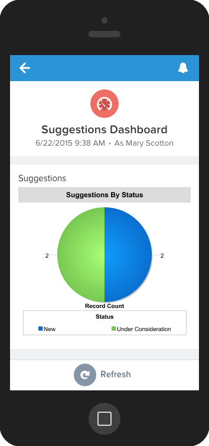
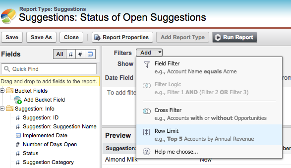
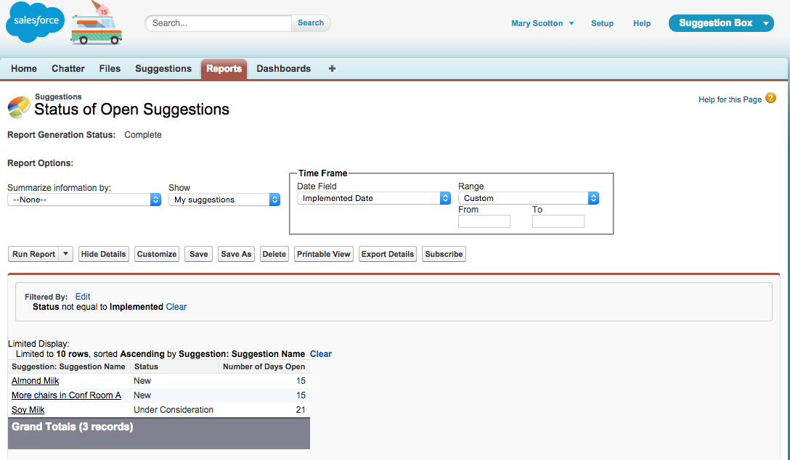
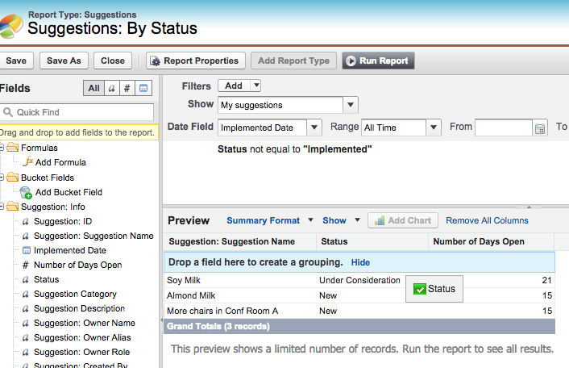
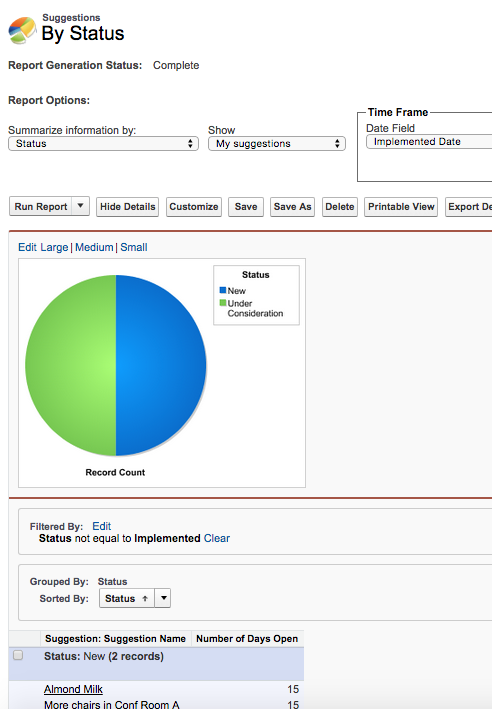
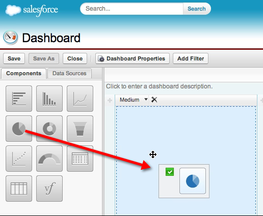
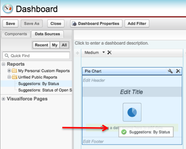

## [Eöש是Creating Reports and Dashboards是שöE是]

#### [ש是What You’ll Do是ש]

* [Eöש是Eöש是Create a simple tabular report to list open suggestions.是שöE是שöE是]

* [Eöש是ש是Create a summary report with a report chart.是שöE是שö]

* [Eöש是Eöש是Create a simple dashboard based on the summary report.是שöE是שöE]

* [Eöש是Eöש是是Try the reports and dashboards in the Salesforce1 Mobile app.是שöE是שöE是]

[Eöש是Eöש是Eöש是Eöש是Eöש是Eöש是ש是The Suggestion Box app you created with the App Quick Start wizard includes a Reports tab and a Dashboards tab, where you can create, edit, and run reports and dashboards. These features make an app more useful by providing the business with valuable insights.是שöE是שöE是שöE是שöE是שöE是שöE是ש]

#### [Eöש是Step 1: Create a Tabular Report是שöE是]

[Eöש是Eöש是Eöש是Eöש是Eöש是Eöש是öש是Let’s start with a simple tabular report to show the number of suggestions received and the status of each one. A tabular report presents data in simple rows and columns, much like a spreadsheet. You can use it to show column summaries, like sum, average, maximum, and minimum.是שöE是שöE是שöE是שöE是שöE是שöE是שöE]

1. [Eöש是ש是 On the Reports tab, click **New Report**.是שöE是שö]

2. [Eöש是Eöש是Eöש是öש是 In the Quick Find box, enter **Suggestions**. In the Other Reports folder, choose **Suggestions**.是שöE是שöE是שöE是שö]

3. [ש是 Click **Create**.是שö]

4. [Eöש是Eöש是Eöש是Eöש是ש是 In the Report Builder, notice that the Suggestion Name field is already on the report. In the preview screen, you can see the sample Suggestion records you created in previous steps.是שöE是שöE是שöE是שöE是שö]

5. [Eöש是Eöש是Eöש是Eöש是是 From the Fields pane, in the Suggestion: Info folder, drag **Status** and **Number of Days Open** onto the preview and drop them to the right of the Suggestion Name field.是שöE是שöE是שöE是שöE是]

6. [Eöש是Eöש是Eöש是是 Set a row limit for this report so that it doesn’t get out of hand. From the Add drop-down menu next to Filters, choose **Row Limit**.是שöE是שöE是שöE是ש]

    

7. [Eöש是öש是 Click **OK** to accept the default 10-row limit.是שöE是שöE]

8. [Eöש是Eöש是Eöש是Eöש是öש是 To make sure that you’re viewing only suggestions that still need to be implemented, click **Add** next to Filters and set the filter to **Status Not Equal To Implemented**. Click **OK**.是שöE是שöE是שöE是שöE是שö]

9. [Eöש是Eöש是 Click the **Dashboard Settings** button at the top.是שöE是שöE]

10. [Eöש是ש是 For the Name field, choose **Status**.是שöE是ש]

11. [Eöש是Eöש是Eöש是Eöש是 For the Value field, choose **Number of Days Open** and then click **OK**. *(Steps 9, 10, and 11 are needed only if the tabular report is used in a dashboard.)*是שöE是שöE是שöE是שöE]

12. [Eöש是Eöש是Eöש是 Click **Save**, and name your report **Suggestions: Status of Open Suggestions**.是שöE是שöE是שöE是]

13. [Eöש是Eöש是Eöש是Eöש是Eöש是Eöש是 In the Report Folder drop-down list, select **Unfiled Public Reports** so that everyone can access it. (If you don’t want this report to be accessible to everyone, create a folder and give different people different levels of access to it.)是שöE是שöE是שöE是שöE是שöE是שöE]

14. [Eöש是 Click **Save and Run Report**.是שöE是]

    

#### [Eöש是öש是Step 2: Create a Summary Report and a Report Chart是שöE是שöE]

[Eöש是Eöש是Eöש是Eöש是Eöש是It’s often a good idea to give users a visual way to understand the data in your report. Tabular reports don’t include charts, so let’s copy the report and make a Summary report. Then, you can add a chart.是שöE是שöE是שöE是שöE是שöE是]

1. [Eöש是Eöש是Eöש是Eöש是 From the Report Results view of the Suggestions: Status of Open Suggestions report, click **Save As** and enter **Suggestions: By Status** as the report name.是שöE是שöE是שöE是שöE]

2. [Eöש是是 Click **Save & Return to Report**.是שöE是]

3. [öש是 Click **Customize**.是שö]

4. [Eöש是Eöש是öש是 Click **Tabular Format** and choose **Summary**. If presented with a warning message, click **Yes** to proceed.是שöE是שöE是שö]

5. [Eöש是Eöש是ש是 Drag the **Status** field column to the shaded area labeled **Drop a field here to create a grouping**.是שöE是שöE是שö]

    

6. [Eöש是Eöש是Eöש是 Click **Add Chart**. In the Chart Editor that appears, click the **Pie Chart**.是שöE是שöE是שöE]

7. [Eöש是Eöש是Eöש是ש是 In the Values picklist, choose **Record Count**. In the Wedges picklist, choose **Status**.是שöE是שöE是שöE是ש]

8. [Eöש是是 Click **OK**, and then **Save**.是שöE是]

9. [öש是 Click **Run Report**.是שöE]

[Eöש是Eöש是ש是The pie chart displays above the report results and shows the total number of open suggestions by status.是שöE是שöE是שö]

#### [Eöש是Step 3: Create a Dashboard是שöE]

[Eöש是Eöש是Eöש是Eöש是Eöש是Eöש是Dashboards in Salesforce are like a dashboard in your car, showing you important information at a glance. Dashboards can show data in charts, gauges, tables, metrics, or other formats (using a Visualforce page). Dashboards are powered by reports.是שöE是שöE是שöE是שöE是שöE是שöE是]

1. [Eöש是öש是 In the Reports tab, click **New Dashboard**.是שöE是שö]

2. [Eöש是Eöש是öש是 In the Components tab, drag the **Pie Chart** component and drop it in the first column of the new dashboard.是שöE是שöE是שö]

    

3. [Eöש是Eöש是Eöש是Eöש是ש是 In the Data Sources tab, under Reports > Unfiled Public Reports, drag the **Suggestions: By Status** report and drop it on top of the Pie Chart component that is in the dashboard.是שöE是שöE是שöE是שöE是ש]

    

4. [Eöש是Eöש是 Click **Edit Header** and add the header **Suggestions**.是שöE是שöE是]

5. [Eöש是Eöש是ש是 Click **Edit Title** and add the title **Suggestions By Status**.是שöE是שöE是ש]

6. [Eöש是Eöש是ש是 Click **Save** and name the dashboard **Suggestions Dashboard**.是שöE是שöE是ש]

7. [Eöש是是 Click **Save and Run Dashboard**.是שöE是]

#### [Eöש是Step 4: Try Out the Mobile App是שöE是]

[Eöש是Eöש是Eöש是Eöש是Eöש是Eöש是You are now a mobile app developer! This is a simple but complete app, and from here you can continue to add functionality or build another app with these skills. Let's see how these reports and dashboards look in the Salesforce1 Mobile app.是שöE是שöE是שöE是שöE是שöE是שöE]

1. [Eöש是Eöש是Eöש是 Click the  icon to open the left navigation bar.是שöE是שöE是שöE]

2. [Eöש是Eöש是ש是 Scroll down and click **Reports** in the Apps section to display the reports that you recently viewed.是שöE是שöE是שö]

3. [Eöש是öש是 Click either of the reports that you created.是שöE是שö]

4. [Eöש是Eöש是öש是 Sort the columns, and click a row in the report to test its functionality.是שöE是שöE是שö]

5. [Eöש是Eöש是öש是 Now let’s try the dashboard. Click the  icon to open the left navigation bar.是שöE是שöE是שö]

6. [Eöש是Eöש是öש是 Click **Dashboards** to display the dashboards that you recently viewed.是שöE是שöE是שö]

7. [Eöש是Eöש是öש是 Click the **Suggestions Dashboard**. You should see something like this:是שöE是שöE是שö]

## [ש是Summary是]
[Eöש是Eöש是Eöש是Eöש是Eöש是Eöש是Eöש是Eöש是Eöש是Eöש是Eöש是Eöש是Eöש是Eöש是Eöש是You did it! You built a simple suggestions management app, all without a single line of code! You started by creating the simple data model and the default user interface for managing suggestions. You then customized the user experience on the browser and mobile app by using drag-and-drop editors. Next, you added business logic with the formula language and process builder. Finally, you created some reports and dashboards so that you could monitor and analyze your business data. You can continue your journey and dive deeper by following the links in the **Resources** sections of this project.是שöE是שöE是שöE是שöE是שöE是שöE是שöE是שöE是שöE是שöE是שöE是שöE是שöE是שöE是שöE]

## [ש是Resources是ש]

* [Eöש是Eöש是Eöש是Eöש是ש是<a target="_blank" href="https://developer.salesforce.com/trailhead/reports_dashboards/reports_dashboards_overview">Reports & Dashboards > Getting Started with Reports and Dashboards</a>是שöE是שöE是שöE是שöE是שö]

* [Eöש是Eöש是Eöש是Eöש是是<a target="_blank" href="https://developer.salesforce.com/trailhead/reports_dashboards/reports_dashboards_getting_started">Reports & Dashboards > Using the Report Builder</a>是שöE是שöE是שöE是שöE是ש]

* [Eöש是Eöש是Eöש是Eöש是<a target="_blank" href="https://developer.salesforce.com/trailhead/reports_dashboards/reports_dashboards_report_types">Reports & Dashboards > Using Report Formats</a>是שöE是שöE是שöE是שöE是]

* [Eöש是Eöש是Eöש是Eöש是是<a target="_blank" href="https://developer.salesforce.com/trailhead/reports_dashboards/reports_dashboards_visualizing_data">Reports & Dashboards > Visualizing Your Data</a>是שöE是שöE是שöE是שöE是]
