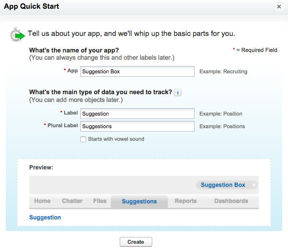
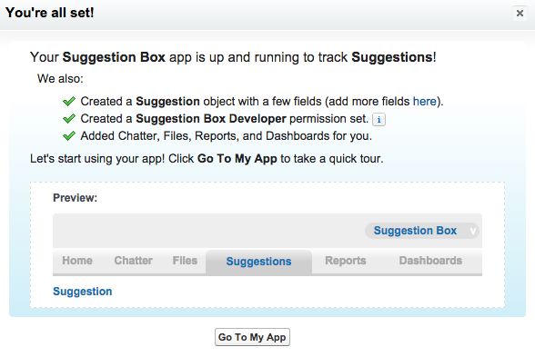
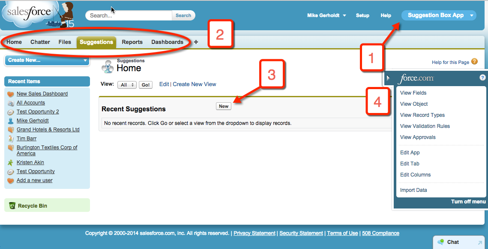
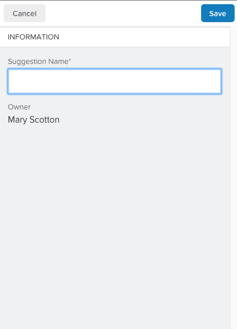

## Introduction

In this project, you learn how to build an application on the Salesforce1 Platform from start to finish, without writing any code. If you're new to the Salesforce1 Platform, the goal is to introduce you to the basics of app building. These point-and-click skills apply whether or not you plan to write code on the platform. If you're familiar with the Salesforce1 Platform Admin features—managing users and security, customizing standard objects, and so on—the goal is to apply those skills to developing new applications. You need a Developer Edition org to complete this project. If you don't have one, you can sign up <a target="_blank" href="https://developer.salesforce.com/signup">here</a>.

You will build a suggestion management app that allows employees to submit suggestions and track their status using these steps.

1. Create the app definition and a data model for the application. This simple application requires only one custom object.

2. Modify the user interface on the browser and on Salesforce1 Mobile using page layouts, compact layouts, and global actions.

3. Automate calculations, data quality, and database updates to improve the user experience using formulas, validation rules, and a process builder.

4. Define reports, charts, and dashboards to track the status of suggestions and analyze how well the company manages suggestions.

Note: Instead of creating a Suggestions custom object, you could use Cases, a Salesforce Service Cloud standard object. But in this example, we want to explore building a custom app without using Service Cloud.

## Creating a Suggestion Box App

#### What You’ll Do

* Create a Force.com app that includes standard collaboration and analytics features.

* Familiarize yourself with the app’s user interface in the browser and in the Salesforce1 Mobile app. 

#### Step 1: Create an App and a Custom Object

1. Log in to your Developer Edition (DE) org using your username (in the form of an email address) and password.

3. From the Force.com Home page, click the green **Add App** button in the Getting Started section. If you’re starting from somewhere else, click **Setup** in the upper right corner to get to the Force.com Home page.

4. Fill in the form as follows:
   * App: **Suggestion Box**
   * Label: **Suggestion**
   * Plural Label:  **Suggestions** 
  
5. Click **Create**. Right away you see some of the functionality that’s automatically added.
   
6. Click **Go To My App**.
7. Click **Start Tour** and follow along for a quick overview of your app’s built-in user interface.

#### Step 2: Tour the App

  

1. **Force.com app menu** — Shows the apps that are available to you. The app you just created is selected.

2. **Tabs** — Provides an easy way to find and organize data within an app. In the Suggestions tab, you can create, view, and edit Suggestion records. The other tabs are standard feature tabs that are included with every app.

3. **Create records** — Click **New** to add records to your custom object. If you click this button now, you see only one data entry field in the object, but you’ll create more in the following steps.

4. **Force.com Quick Access menu** — Quickly jump to relevant app customization features. The menu is available from any object list view page and record detail page, but only for users with the "Customize Application" permission.

#### Step 3: Try Out the Mobile App

When you create an app in the Salesforce1 Platform, you automatically create a mobile version of the app. You can access the Salesforce1 mobile app in two ways:

* As a downloadable mobile app (Salesforce1) that you install on your phone

* By navigating to login.salesforce.com using a mobile browser

For this step, we'll use the last option.

1. Open a browser on your phone or tablet and navigate to http://login.salesforce.com. The mobile browser version of Salesforce1 is displayed. 

To see your Suggestions:

1. Click the  icon to open the left navigation bar.

2. Find the Suggestions object under Recent (you need to click **Show More** to see it). Click **Suggestions** to display your recently viewed suggestions, if you have any.

3. Click **New** to create a suggestion. 
    
4. Enter a sample suggestion (maybe something like "classic Galaga arcade game in every conference room!"), and click **Save**.

With just one button click, you're on your way to building a mobile app!

## Resources

* <a target="_blank" href="https://developer.salesforce.com/trailhead/starting_force_com/starting_intro">Salesforce Platform Basics > Getting Started with the Platform</a>

* <a target="_blank" href="https://developer.salesforce.com/trailhead/salesforce1_mobile_app/salesforce1_mobile_app_intro">Salesforce1 Mobile Basics > Getting Started with the Salesforce1 Mobile App</a>
