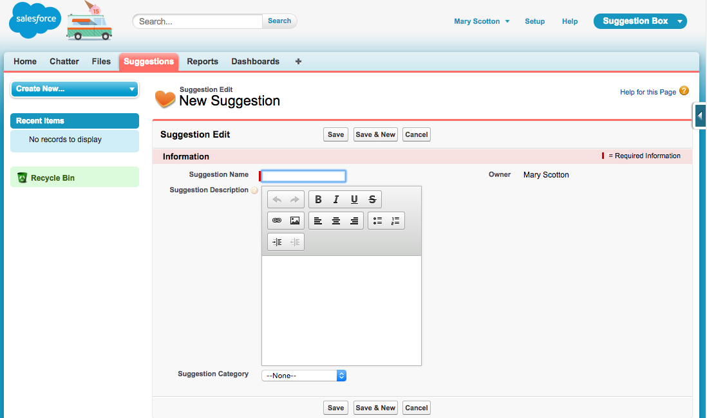
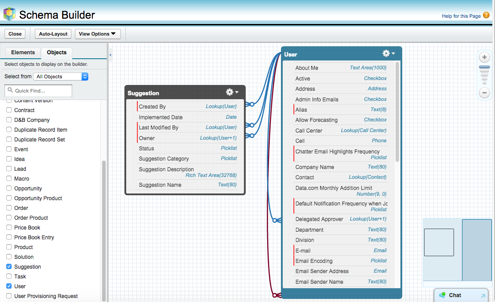
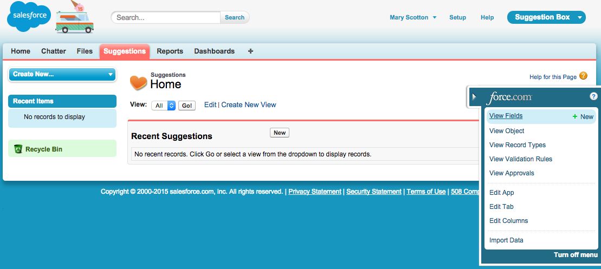
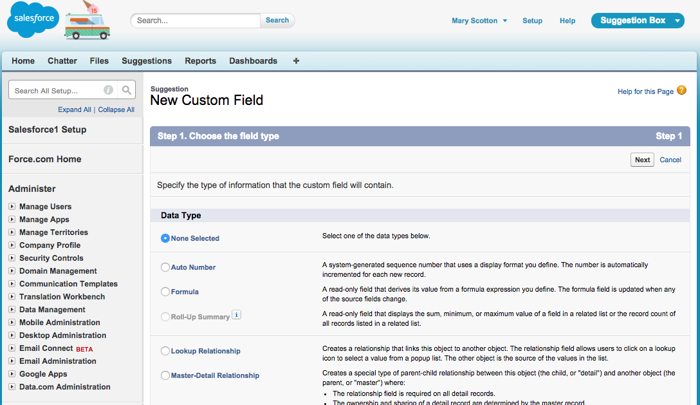

## Adding Custom Fields

#### What You’ll Do

* Create custom fields with the Custom Field Wizard and the Schema Builder.

* Try the app in the browser and in the Salesforce1 Mobile app.

By default, your custom object has some standard fields on it. You need to add more fields to store relevant information about each suggestion. Fields can store many types of data. Feel free to explore these later as you extend your app. For now, let’s add a few that we know we need.

You can add a new field from the Force.com Quick Access menu by hovering on **View Fields** and clicking **New**. 

You can also add a new field this way:

1. Click **Setup** | **Build** | **Create** | **Objects.**

2. Click the name of your object (in this example, click **Suggestion**).

3. Scroll down to the **Custom Fields & Relationships** section.

4. Click **New.**

Both ways get you to the New Custom Field wizard.

#### Step 1: Add a Description field

This field will be used by employees when they explain their suggestion. You’ll create the field as a rich text area so that they can change font styles, add pictures, etc.

Create the **Suggestion Description** field as follows:

1. For Data Type, select **Text Area (Rich)**, and click **Next**.
    
2. Fill in the custom field details:
  * Field Label: **Suggestion Description**
  * Length: **32,768**
  * Visible Lines: **10**
  * Field Name: **Suggestion_Description**
  * Help Text: **Please enter as much detail - including pictures - around this suggestion so we clearly understand your idea.**
3. Click **Next**.

4. Click **Next** again to accept the default field visibility and security settings.

5. Click **Save & New** to add the Suggestion Description to the page layout, save the Suggestion Description field, and return to the first step of the wizard.

#### Step 2: Add a Category Field

This field will help us categorize each suggestion. It will also make it easier for us to report on what types of suggestions we get the most.

Create the **Suggestion Category** field as follows:

1. For Data Type, select **Picklist**, and click **Next**.

2. Fill in the custom field details:
  * Field Label: **Suggestion Category**
  * Enter the following values for the picklist (one per line)
    - **Customer Service**
    - **Employee Services**
    - **Facilities/ IT**
    - **Kitchen Snacks**
    - **Other**
  * Leave the Sort Values Alphabetically - **Unchecked**.
  * Leave the Use first value as default value - **Unchecked**.
3. Leave the defaults for the remaining fields, and click **Next**.

4. Click **Next** again to accept the default field visibility and security settings.

5. Click **Save** to add the Suggestion Category to the page layout and save the Suggestion Category field.

#### Step 3: Try Out the App

Check your work by returning to the Suggestions tab and clicking the **New** button. You should see that your two custom fields were added to the Suggestion page. Fill in a sample suggestion and click **Save**. 

Try adding a record in the Salesforce1 Mobile App, too. Note that the Suggestion page layout is the same on the browser as it is in the mobile app. That's the power of "build once, deploy anywhere" metadata.

#### Step 4: Viewing Objects in Schema Builder

Schema Builder provides a dynamic environment to add new custom objects, custom fields, and relationships to your Salesforce database. It also eliminates the need to click from page to page to add a new custom field to an object or to find the details of a relationship. 

Let’s take a look at the Suggestion custom object in the Schema Builder.

1. Click **Setup** | **Build** | **Schema Builder**.

2. From the Objects Palette (left-hand side) select the **Suggestion** object and the **User** object.

3. If you don’t see your objects in the Canvas area, click **Auto-Layout** and drag them around until you like how they are arranged. 

Let’s add more fields so that you can track the progress of a Suggestion.

#### Step 5: Add a Status field

This field will help us track the status of the suggestion. It is also a way for the suggestor to know what is going on with their suggestion.

This field will have unique security around it in that only Admins can change the status.

1. Click the **Elements** tab in the left-hand side Palette. This displays all of the new things you can add to your database schema: objects and fields.

2. Drag the **Picklist** field type and drop it on the Suggestions object.

3. Fill in the custom field details:
  * Field Label: **Status**
  * Field Name: **Status**
  * Enter the following Values for the picklist (one per line)
    - **New**
    - **Under Consideration**
    - **In Progress**
    - **Implemented**
4. Leave the Sort Values Alphabetically - **Unchecked**.

5. **Check** the Use first value as default value.

6. Click **Save** to save the Status field. You should see the Status field at the top of the list of fields in the Suggestion object’s box in the schema diagram.

7. Now, we'll update the Status field's security. While still in the Schema Builder, right-click on the Status field that you just added to the Suggestion object. Click **Manage Field Permissions**. 

8. Click the **Read-Only** checkbox at the top of the column to make this field read only for all users.

9. **Uncheck** the box in the Read-Only column next to System Administrator, then click **Save**.

#### Step 6: Add a Date field

This field will help us track when the Suggestion was Implemented. It’s also important for us because we reference this field in the formula field created in a later exercise.

This field will have unique security around it in that only Admins can change the date.

1. Drag the **Date** field type and drop it on the Suggestions object.

2. Fill in the custom field details:
  * Field Label: **Implemented Date**
  * Field Name: **Implemented_Date**
  * Leave the defaults for the remaining fields
  * Click **Save** to save the Implemented Date field. You should see the Implemented Date field at the top of the list of fields in the Suggestion object’s box in the schema diagram.
3. Now, we'll update the Implemented Date field's security. While still in the Schema Builder, right-click on the **Implemented Date** field that you just added to the Suggestion object. Click **Manage Field Permissions**. 

4. Click the **Read-Only** checkbox at the top of the column to make this field read only for all users.

5. **Uncheck** the box in the Read-Only column next to System Administrator, then click **Save**.

#### Step 7: Try Out the App

Go back to the Suggestions tab in the browser, or to the Suggestions object in the Salesforce1 Mobile app, and create a new Suggestion record.

Notice anything? Where are our two new fields we just created, Status and Implemented Date?

Don’t worry, they are there, just not on the page layout. When you use the Field Wizard, you have the option to add the field to the page layout automatically. When you use the Schema Builder, you need to add the field using the Page Layout Editor. In the next exercise, we’ll do that, and make some other modifications to the user experience, to make the app easier to use.

## Resources

* <a target="_blank" href="https://developer.salesforce.com/trailhead/force_com_admin_beginner/data_modeling/creating_custom_objects_fields">Data Modeling > Creating Custom Objects and Fields</a>

* <a target="_blank" href="https://developer.salesforce.com/trailhead/force_com_admin_beginner/data_modeling/schema_builder">Data Modeling > Working with Schema Builder</a>
