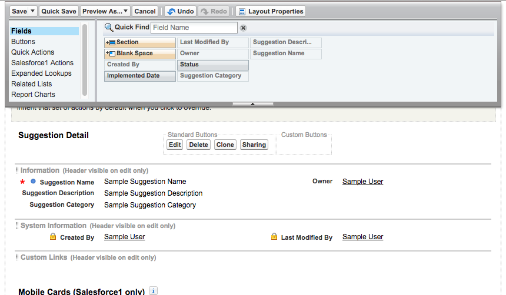
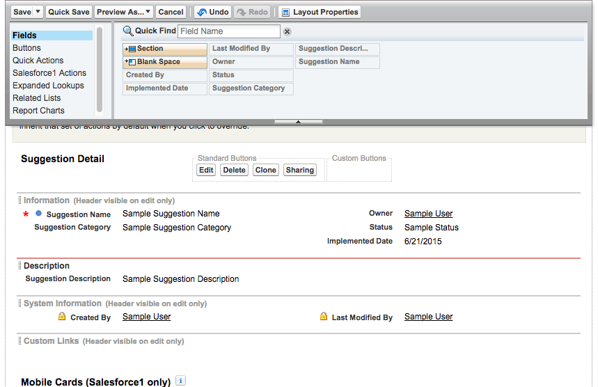
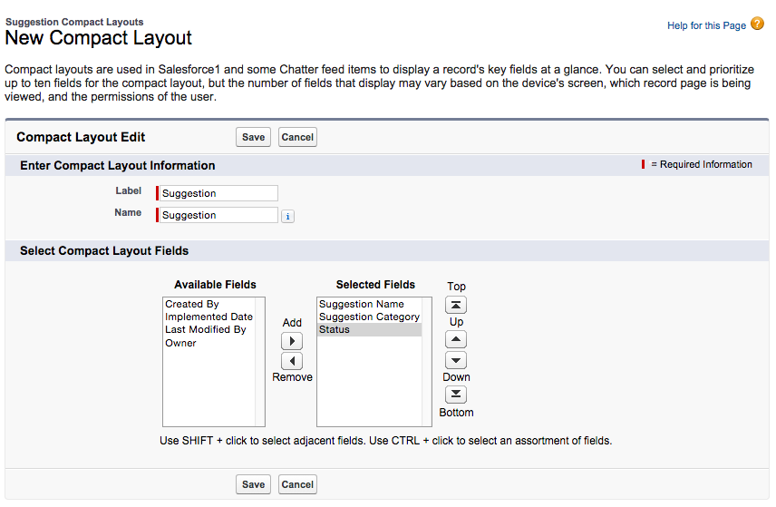
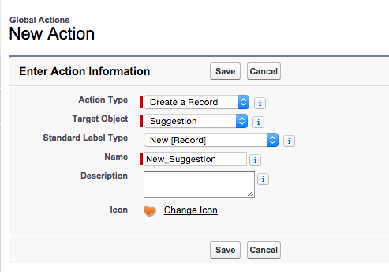
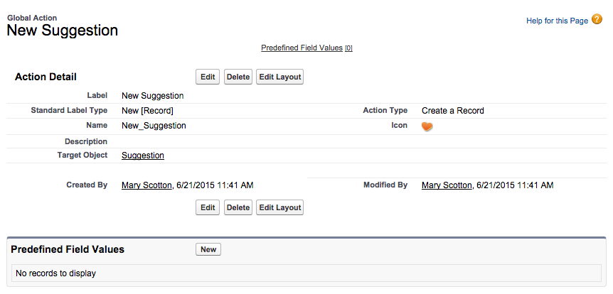
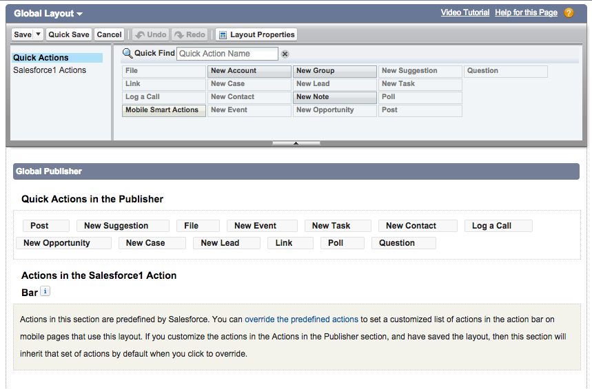

## Modifying the User Experience

#### What You’ll Do

* Modify the page layout.

* Modify the mobile user interface with a compact layout.

* Add a global action to add suggestions directly from the Feed.

* Try the app in the browser or in the Salesforce1 Mobile app.

In the previous exercise you created fields to manage the data. Now, let’s make sure that employees have a great experience logging their Suggestions by arranging the fields in a usable manner, bringing the most important fields to their attention and making common tasks easy to do.

Changing the UI for the browser and mobile pages involves modifying the Suggestion object's page layout. You’ll also modify the Suggestion object's compact layout, which changes only the mobile app UI. Finally, you’ll add a Global Action to make it easy for employees to add suggestions wherever they are in the Salesforce app in both the browser and the mobile app.

#### Step 1: Modify the Page Layout

1. Click **Setup | Build | Create | Objects | Suggestion**.

2. Scroll down to the Page Layouts section, and click **Edit** next to the Suggestion Layout page layout. The Page Layout Editor opens.

3. Scroll down to the Suggestion Detail section.

    

4. In the Page Layout Editor, you have can have one or two columns in each section. Let’s add the missing fields and group fields together.
  * Click the **Status** field and drag it to the right column in the Information section, under Owner.
  * Click the **Implemented Date** field and drag it to the right column in the Information section, under Status.
  * Click **Quick Save**.

Now add a new section and rearrange the remaining fields.

1. Add a section for Description. In the palette, click **Section** and drag it down until a green bar appears above the System Information section. Drop it there to create the section.

2. In the Section Properties box, enter **Description** for the section name.

3. Choose **1-column** for the layout.

4. Click **OK**.

5. Drag the **Suggestion Description** field into your new section. Your page should look like this when finished.

    

7. Click **Save**.

#### Step 2: Add a Compact Layout

Mobile app users can now see the Status and Implemented Date fields, but with a small screen size, it’s useful to display important fields at the top of the screen. For custom objects, the Name field displays at the top by default. To add the other fields, you modify the compact layout.

1. Click **Setup | Build | Create | Objects | Suggestion**.

2. Scroll down to the Compact Layouts section and click **New**.

3. Enter the layout details.
  * Label: **Suggestion**
  * Name: **Suggestion**
  * Selected Fields: **Suggestion Name, Suggestion Category, Status** 
    
4. Click **Save**.

5. Click **Compact Layout Assignment**.

6. Click **Edit Assignment**.

7. Select **Suggestion** as the primary compact layout.

8. Click **Save**.

#### Step 3: Add a Global Action

Things are looking pretty good, but from talking to employees about how they work, we’ve found that they think of suggestions while they’re doing other tasks and don’t want to leave what they are doing to submit a suggestion. For example, if an employee is entering a contact name and thought of a customer service suggestion, the employee would have to do the following to enter a suggestion:

* Navigate to the Suggestion object
* Click New
* Fill in the Suggestion information
* Save
* Navigate back to the Contact record
* Try to remember what they were doing!

You want to make it easier for employees by reducing the number of clicks and keeping them in context. You can do this with a Global Action.

1. Click **Setup | Build | Create | Global Actions | Global Actions**.

2. Click **New Action**.

3. Enter the action details.
  * Action Type: **Create a Record**
  * Target Object: **Suggestion**
  * Standard Label Type: **New [Record]**
  * Name: **New_Suggestion** 
    

3. Click **Save**. This takes you to the Global Action layout so that you can select the fields to display when the action is selected.

4. Drag **Suggestion Category** and **Suggestion Description** onto the New Suggestion layout so that employees can enter those values when creating a suggestion.

5. Click **Save**.

    
6. In the Predefined Field Values section, click **New**.

7. Enter the predefined field value details.
  * Field Name: **Status**
  * A specific value: **New**
8. Click **Save**. You have created a new action, but users cannot see it yet! Let's fix that next.

9. Click **Setup | Build | Create | Global Actions | Publisher Layouts**.

10. Next to Global Layout, click **Edit**.

11. Drag the **New Suggestion** action into the Quick Actions in the Publisher section and drop it in the second position, after Post.

    
12. Click **Save**.

#### Step 4: Try Out the App

In the Suggestions tab, click **New** and fill out a suggestion. Notice how the experience has changed in the page layout. Switch to the mobile experience and add a suggestion from the mobile navigation menu. You should see the page layout changes and the new fields at the top of the screen from the compact layout change. Finally, add a suggestion from the Feed in the mobile app. Does the global action make it easier? If so, consider updating the page layouts for specific objects (like Contact) to add the New Suggestion action to the action bars that display when viewing those records.

## Resources

* <a target="_blank" href="https://developer.salesforce.com/trailhead/customizing_user_interface/ui_page_layouts">UI Customization > Modifying Page Layouts</a>

* <a target="_blank" href="https://developer.salesforce.com/trailhead/salesforce1_mobile_app/salesforce1_mobile_app_compact_layouts">Salesforce1 Mobile Basics > Customizing Compact Layouts</a>

* <a target="_blank" href="https://developer.salesforce.com/trailhead/salesforce1_mobile_app/salesforce1_mobile_app_actions_global">Salesforce1 Mobile Basics > Creating Global Quick Actions</a>

* <a target="_blank" href="https://developer.salesforce.com/trailhead/salesforce1_mobile_app/salesforce1_mobile_app_actions_objectspecific">Salesforce1 Mobile Basics > Creating Object-Specific Quick Actions</a>
