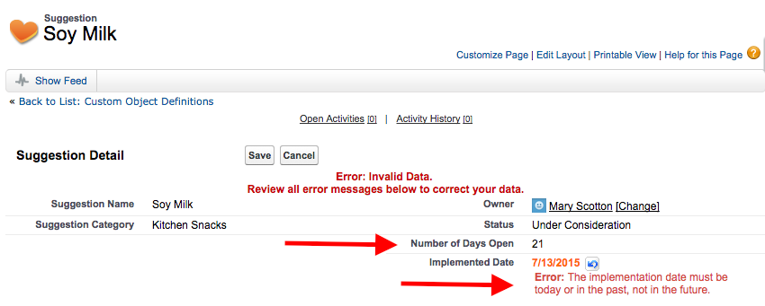
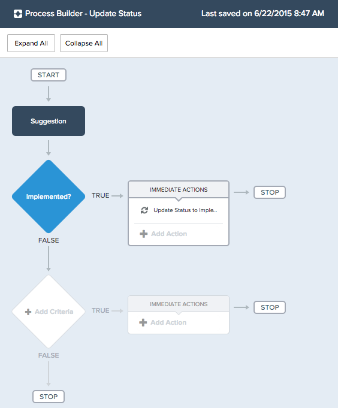
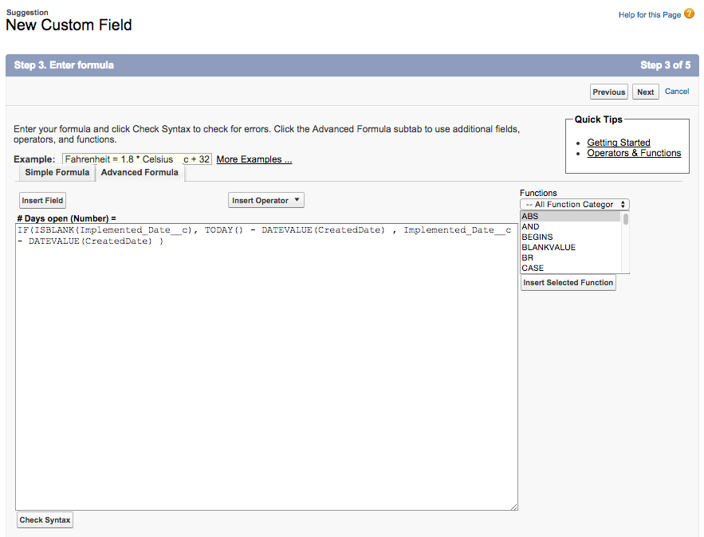
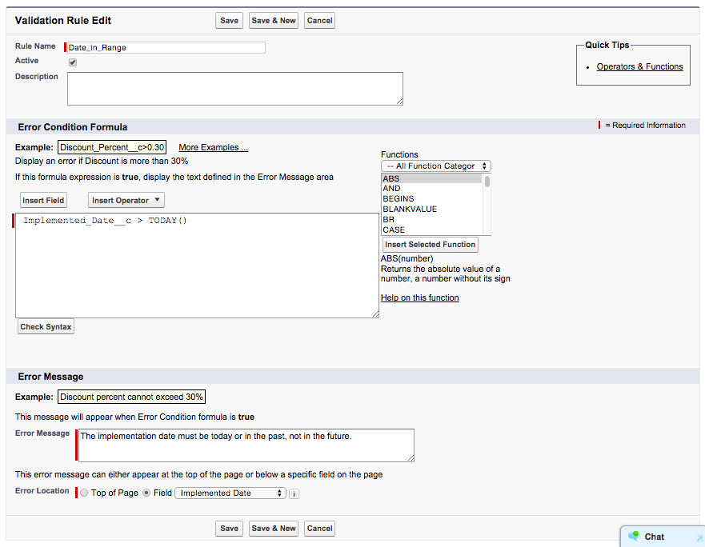
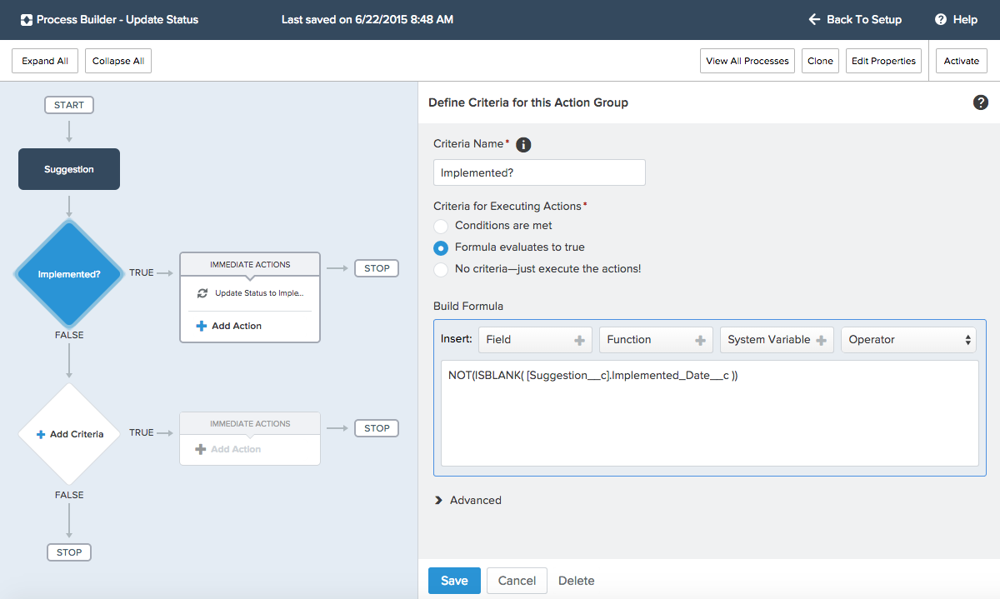
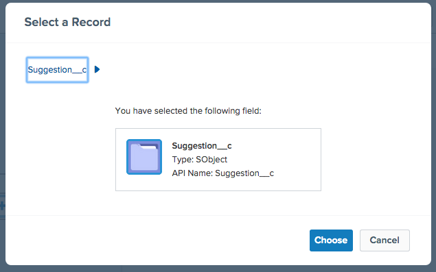
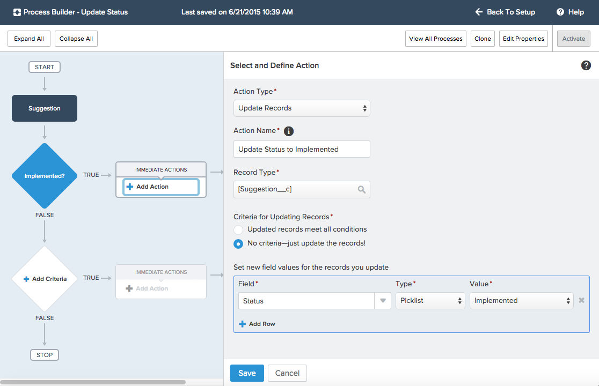

## Adding Business Logic 

#### What You’ll Do

* Create a custom formula field to calculate the length of time between two dates.

* Add a validation rule to enforce that the implemented date is not in the future.

* Create a process to update a field when the value of another field changes.

* Try the app in the browser or Salesforce1 Mobile app.

So far, your app lets employees securely enter and view data about suggestions on a browser or a mobile device. That’s pretty cool, but let’s make the platform work a little harder for us so that our users don’t have to.

#### Step 1: Add a Formula Field 

A formula field derives its value from other fields, expressions, or values, saving your users a lot of time. Let’s add a formula field to calculate the number of days from suggestion creation to implementation. 

1. Click **Setup | Build | Create | Objects | Suggestion**. 

2. In the Custom Fields & Relationships section, click **New**.

3. For the data type, select **Formula** and click **Next**.

4. Enter the field details, and then click **Next**.
  * Field Label: **Number of Days Open**
  * Formula Return Type: **Number** 
  * Decimal Places: **0**

5. Click the **Advanced Formula** tab.

6. In the Formula Editor, type the following formula: `IF(ISBLANK(Implemented_Date__c), TODAY() - DATEVALUE(CreatedDate), Implemented_Date__c - DATEVALUE(CreatedDate) )` 
   
7. Click **Next** and **Next** again to accept the default field visibility and security settings.

8. Click **Save** to save the Number of Days Open field and add it to the Suggestion layout.

#### Step 2: Add a Validation Rule

Formulas are also used to ensure data quality and enforce business rules. Our employees cannot predict the future, so let’s create a validation rule to make sure that they don’t enter implementation dates that haven’t happened yet. With validation rules, you define the condition for "bad" data. When the system evaluates the rule, it blocks the user from saving the data if the condition is **true**.

1. Click **Setup | Build | Create | Objects | Suggestion**.

2. Scroll down to the Validation Rules section and click **New**. 

3. Enter the rule details.
  * Rule Name: **Date\_in\_Range**
  * Formula editor: <pre>Implemented\_Date\__c > TODAY()</pre>
  * Error Message: **The implementation date must be today or in the past, not in the future.**
  * Error Location: **Field, Implemented Date** 
   
4. Click **Save**.

#### Step 3: Add a Field Update Using Process Builder

Formulas are also useful when automating business processes. Let’s make it easy on the person who has to act on all the suggestions by saving them some time. When a user adds an implemented date, let’s update the status automatically to Implemented.

1. From Setup, click **Create | Workflow & Approvals | Process Builder**.

2. On the Welcome page, click **New**.

3. Enter the process details, and then click **Save**.
  * Process Name: **Update Status** 
  * API Name: **Update_Status**
  * Description: **Updates status to Implemented when Implemented Date field is populated.**
  
4. Click **Add Object** and associate the process with the **Suggestion** object and specify when to start the process. For this process, select **when the record is created or edited**. 
  
5. Click **Save**.

6. Click **Add Criteria**.

7. Name the criteria **Implemented?**.

8. Select **Formula evaluates to true**.

9. Check whether the Implemented Date field is populated by typing the following in the Formula Editor: `NOT(ISBLANK( [Suggestion__c].Implemented_Date__c ))` 
    
10. Click **Save**.

11. Click **Add Action**.

12. Enter the action details, and then click **Choose**.
  * Action Type: **Update Records** 
  * Action Name: **Update Status to Implemented**  
  * Record Type: **Suggestion__c** (click the Suggestion__c object name; don’t select it from the drop-down menu) 
    
 
13. Leave **No criteria—just update the records!** selected.

14. Set the new field value, and then click **Save**.
  * Field: **Status** 
  * Type: **Picklist**
  * Value: **Implemented** 
  
 
15. In the upper right corner, click **Activate** and then click **OK**.

#### Step 4: Try Out the App

Your business logic fires whenever a record is created or updated from the browser or the mobile app. Go back to a Suggestion record and enter a date in the Implemented Date field. Try a date in the future. Did the system block you from saving? Now try today’s date. The Status field should change to Implemented. 

## Resources

* <a target="_blank" href="https://developer.salesforce.com/trailhead/point_click_business_logic/formula_fields">Formulas and Validations > Using Formula Fields</a>

* <a target="_blank" href="https://developer.salesforce.com/trailhead/point_click_business_logic/validation_rules">Formulas & Validations > Creating Validation Rules</a>

* <a target="_blank" href="https://developer.salesforce.com/trailhead/business_process_automation/process_builder">Process Automation > Automating Processes with the Lightning Process Builder</a>
