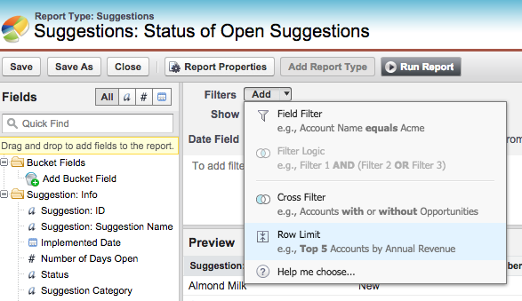
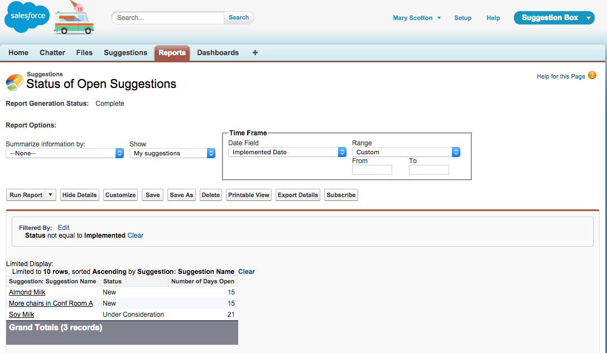
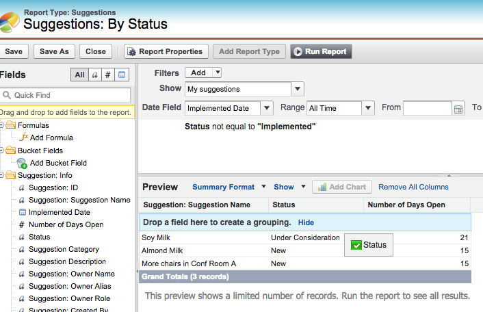
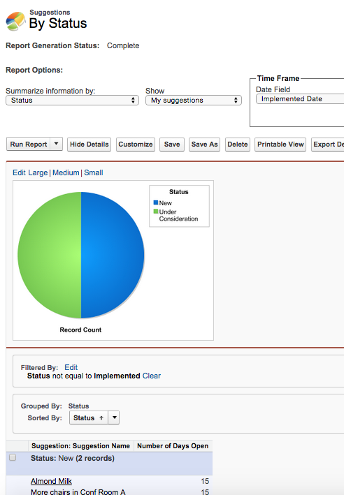
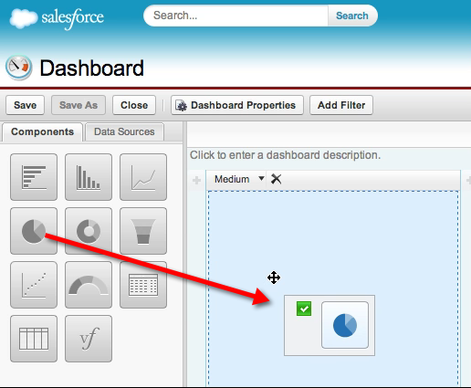
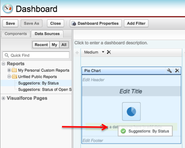
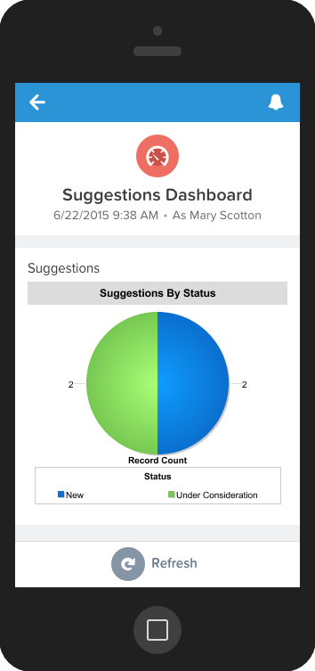

## Creating Reports and Dashboards

#### What You’ll Do

* Create a simple tabular report to list open suggestions.

* Create a summary report with a report chart.

* Create a simple dashboard based on the summary report.

* Try the reports and dashboards in the Salesforce1 Mobile app.

The Suggestion Box app you created with the App Quick Start wizard includes a Reports tab and a Dashboards tab, where you can create, edit, and run reports and dashboards. These features make an app more useful by providing the business with valuable insights.

#### Step 1: Create a Tabular Report

Let’s start with a simple tabular report to show the number of suggestions received and the status of each one. A tabular report presents data in simple rows and columns, much like a spreadsheet. You can use it to show column summaries, like sum, average, maximum, and minimum.

1. On the Reports tab, click **New Report**.

2. In the Quick Find box, enter **Suggestions**. In the Other Reports folder, choose **Suggestions**.

3. Click **Create**.

4. In the Report Builder, notice that the Suggestion Name field is already on the report. In the preview screen, you can see the sample Suggestion records you created in previous steps.

5. From the Fields pane, in the Suggestion: Info folder, drag **Status** and **Number of Days Open** onto the preview and drop them to the right of the Suggestion Name field.

6. Set a row limit for this report so that it doesn’t get out of hand. From the Add drop-down menu next to Filters, choose **Row Limit**.

    

7. Click **OK** to accept the default 10-row limit.

8. To make sure that you’re viewing only suggestions that still need to be implemented, click **Add** next to Filters and set the filter to **Status Not Equal To Implemented**. Click **OK**.

9. Click the **Dashboard Settings** button at the top.

10. For the Name field, choose **Status**.

11. For the Value field, choose **Number of Days Open** and then click **OK**. *(Steps 9, 10, and 11 are needed only if the tabular report is used in a dashboard.)*

12. Click **Save**, and name your report **Suggestions: Status of Open Suggestions**.

13. In the Report Folder drop-down list, select **Unfiled Public Reports** so that everyone can access it. (If you don’t want this report to be accessible to everyone, create a folder and give different people different levels of access to it.)

14. Click **Save and Run Report**.

    

#### Step 2: Create a Summary Report and a Report Chart

It’s often a good idea to give users a visual way to understand the data in your report. Tabular reports don’t include charts, so let’s copy the report and make a Summary report. Then, you can add a chart.

1. From the Report Results view of the Suggestions: Status of Open Suggestions report, click **Save As** and enter **Suggestions: By Status** as the report name.

2. Click **Save & Return to Report**.

3. Click **Customize**.

4. Click **Tabular Format** and choose **Summary**. If presented with a warning message, click **Yes** to proceed.

5. Drag the **Status** field column to the shaded area labeled **Drop a field here to create a grouping**.

    

6. Click **Add Chart**. In the Chart Editor that appears, click the **Pie Chart**.

7. In the Values picklist, choose **Record Count**. In the Wedges picklist, choose **Status**.

8. Click **OK**, and then **Save**.

9. Click **Run Report**.

The pie chart displays above the report results and shows the total number of open suggestions by status.

#### Step 3: Create a Dashboard

Dashboards in Salesforce are like a dashboard in your car, showing you important information at a glance. Dashboards can show data in charts, gauges, tables, metrics, or other formats (using a Visualforce page). Dashboards are powered by reports.

1. In the Reports tab, click **New Dashboard**.

2. In the Components tab, drag the **Pie Chart** component and drop it in the first column of the new dashboard.

    

3. In the Data Sources tab, under Reports > Unfiled Public Reports, drag the **Suggestions: By Status** report and drop it on top of the Pie Chart component that is in the dashboard.

    

4. Click **Edit Header** and add the header **Suggestions**.

5. Click **Edit Title** and add the title **Suggestions By Status**.

6. Click **Save** and name the dashboard **Suggestions Dashboard**.

7. Click **Save and Run Dashboard**.

#### Step 4: Try Out the Mobile App

You are now a mobile app developer! This is a simple but complete app, and from here you can continue to add functionality or build another app with these skills. Let's see how these reports and dashboards look in the Salesforce1 Mobile app.

1. Click the  icon to open the left navigation bar.

2. Scroll down and click **Reports** in the Apps section to display the reports that you recently viewed.

3. Click either of the reports that you created.

4. Sort the columns, and click a row in the report to test its functionality.

5. Now let’s try the dashboard. Click the  icon to open the left navigation bar.

6. Click **Dashboards** to display the dashboards that you recently viewed.

7. Click the **Suggestions Dashboard**. You should see something like this:

## Summary
You did it! You built a simple suggestions management app, all without a single line of code! You started by creating the simple data model and the default user interface for managing suggestions. You then customized the user experience on the browser and mobile app by using drag-and-drop editors. Next, you added business logic with the formula language and process builder. Finally, you created some reports and dashboards so that you could monitor and analyze your business data. You can continue your journey and dive deeper by following the links in the **Resources** sections of this project.

## Resources

* <a target="_blank" href="https://developer.salesforce.com/trailhead/reports_dashboards/reports_dashboards_overview">Reports & Dashboards > Getting Started with Reports and Dashboards</a>

* <a target="_blank" href="https://developer.salesforce.com/trailhead/reports_dashboards/reports_dashboards_getting_started">Reports & Dashboards > Using the Report Builder</a>

* <a target="_blank" href="https://developer.salesforce.com/trailhead/reports_dashboards/reports_dashboards_report_types">Reports & Dashboards > Using Report Formats</a>

* <a target="_blank" href="https://developer.salesforce.com/trailhead/reports_dashboards/reports_dashboards_visualizing_data">Reports & Dashboards > Visualizing Your Data</a>
